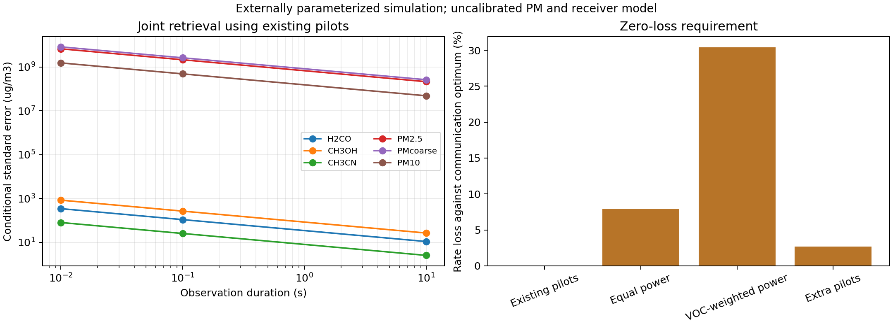

# VOCs, joint PM, and communication preservation in 60–400 GHz

Date: 2026-09-22. Status: implemented exploratory simulation and numerical validation; no measured VOC or atmospheric radio retrieval. The September 8 manuscript remains a historical deliverable.

The subsequent [task 1.3 extension](37_task_1_3_and_detection_metrics.md) replaces the secant path for its new experiment with spherical refracted integration and adds precision/recall, percentage errors and additional plots. The results below retain the explicitly declared earlier geometry as a comparison.

## What was done and why

The requested extension estimates formaldehyde (H2CO), methanol (CH3OH), fine PM and coarse PM, with acetonitrile (CH3CN) as a third VOC. All three VOCs and both PM masses are fitted simultaneously. PM10 is the sum of fine and coarse masses; its uncertainty includes their cross covariance. CO, O3, SO2, NO2, an offset and one background amplitude are nuisance parameters. Methane is evaluated separately as a spectral sensitivity control.

The scope is **60–400 GHz** for every sensing and communication frequency. There are 256 candidate centers, each modeled as a 1 MHz channel: 256 MHz of candidate occupied bandwidth, not a continuous 340 GHz allocation. Simultaneous access to all these channels is a modeling assumption.

Added components:

- [Selectable molecular targets](../src/thz_isac/physical_spectroscopy.py), retaining the original four-gas default.
- [Joint estimator](../src/thz_isac/joint_voc_pm.py), including signed estimates, uncertainty, nonnegative diagnostic estimates and spectral lack-of-fit checks.
- [Communication resource accounting](../src/thz_isac/communication_capacity.py), with communication-optimal equal-bandwidth waterfilling and rejection of candidates that lose rate or exceed power.
- [Independent atmospheric background comparison](../src/thz_isac/itu_background.py), using explicitly selected ITU-R P.676-12 via ITU-Rpy 0.4.0.
- [Acquisition](../scripts/download_voc_spectroscopy.py), [experiment](../scripts/run_voc_pm_capacity.py), [independent replay](../scripts/verify_voc_pm_results.py), and [tests](../tests/test_voc_pm_capacity.py).

## Physical inputs and provenance

HITRANonline supplied main-isotopologue records for the three VOCs, methane, four nuisance gases, H2O and O2. Molecule IDs follow the [HITRAN metadata](https://hitran.org/docs/molec-meta/), with masses from its [isotopologue metadata](https://hitran.org/docs/iso-meta/). No spectral peaks or strengths were invented. Main isotopologues do not constitute a complete isotopic absorption inventory.

| VOC | HITRAN ID | Retrieved line centers within 60–400 GHz |
|---|---:|---:|
| Formaldehyde | 20 | 294 |
| Methanol | 39 | 1,372 |
| Acetonitrile | 41 | 2,825 |

Only these ten molecules were downloaded, not the entire database. Two catalog windows, 0–1,000 and 0–3,000 GHz, test contributions from line wings **inside 60–400 GHz**. They add no out-of-band sensing channels. Restricting line centers themselves to 60–400 GHz changes surface VOC cross-section RMS by about 7.05%, 6.88% and 15.01%, respectively, against the larger catalog window. Expanding from 1,000 to 3,000 GHz changes those VOC results by 1.11%, 0% and 0.0152%; this is a sensitivity test, not a proof of convergence.

The [1,000 GHz acquisition manifest](../results/voc_pm_capacity/acquisition_manifest.json) and [3,000 GHz acquisition manifest](../results/voc_pm_capacity/acquisition_manifest_3000ghz.json) contain acquisition time, record counts and SHA-256 hashes of raw responses and processed CSVs. They identify the exact online response, without claiming a frozen database release. Raw and processed downloads remain in ignored local data directories.

Surface weather comes from the existing training-only reference: 290.35 K, 100,800 Pa and dew point 5.4 °C. The model integrates 24 layers to 12 km and applies a plane-parallel 45° slant factor. Gas, water and PM scale heights remain assumptions of 1,500, 2,000 and 1,000 m. PM retains the existing exploratory Rayleigh modes: diameters 1 and 6 µm, densities 1,500 and 1,800 kg/m³, and refractive indices 1.50+0.01i and 1.53+0.01i. These optical parameters have not been calibrated to measured aerosol spectra.

The reference radio uses the existing 550 km LEO geometry, total 23 dBm transmit power, 0.5/0.3 m transmit/receive apertures, 0.65 aperture efficiency, 6 dB receiver noise figure, 290 K noise temperature and 5 dB implementation loss. This experiment declares a 10,000-symbol frame, 1 µs symbols and 30 already required pilots. The frames are a research resource-accounting assumption, not a measured waveform configuration.

## Communication preservation

The rate model is `(1 - Npilot/Nframe) * sum(B * log2(1 + gain * power))`. It is a parallel Gaussian channel upper bound with known channel gains; see [Tse and Viswanath, Fundamentals of Wireless Communication](https://web.stanford.edu/~dntse/wireless_book.html). Both sides of the comparison use the same atmosphere, candidate channels, power budget, bandwidth and mandatory pilots.

The accepted policy uses communication-optimal power and processes existing pilots for sensing. No extra transmission or sensing pilot is introduced. Accumulating those pilots over more frames consumes observation time and assumes channel and concentrations remain stable. Tones below the predeclared 5 dB per-pilot SNR threshold are omitted only from sensing; their communication power is not redistributed by that mask.

With ITU-R P.676-12 background and the larger VOC catalog window:

| Candidate | Rate (Mbit/s) | Loss relative to communication optimum | Zero-loss check |
|---|---:|---:|---|
| Reuse existing pilots and power | 816.936 | 0% | Pass |
| Equal power on every candidate | 752.617 | 7.873% | Reject |
| Heuristic VOC-weighted power | 568.581 | 30.401% | Reject |
| Add 270 pilots per frame | 794.812 | 2.708% | Reject |

Evidence: [capacity contract](../results/voc_pm_capacity/itu676-12_3000ghz/capacity_contract.csv). The VOC weighting is a deliberately simple comparison, not an optimized sensing policy. Zero incremental loss is established within this resource model; absolute deployed throughput, channel estimation overhead, RF switching, phase tracking and processing constraints remain unvalidated. Pollutant/weather changes can still change absolute link capacity; sensing reuse cannot eliminate atmospheric fading.

## Joint retrieval results

The likelihood uses coherent pilot noise in attenuation units, with variance `2 * (10/ln(10))² / (Npilot*SNR) + sigma_residual²`. We evaluate residual standard deviations of 0 and 0.001 dB. The residual term is independent across tones and does not average away with more frames; it is an assumed scenario, not a receiver calibration measurement.

The following are **conditional one-standard-deviation errors**, not measured concentrations or validated detection limits. They use 10 seconds, 30,000 existing pilots and the zero-residual ITU background scenario:

| Joint target | Standard error (µg/m³) | Approximate standard error (ppb) |
|---|---:|---:|
| Formaldehyde | 10.822 | 8.637 |
| Methanol | 26.441 | 19.773 |
| Acetonitrile | 2.525 | 1.474 |
| PM2.5 | 2.120 × 10⁸ | — |
| Coarse PM | 2.602 × 10⁸ | — |
| PM10 | 4.819 × 10⁷ | — |

Evidence: [all durations and residual scenarios](../results/voc_pm_capacity/itu676-12_3000ghz/joint_precision.csv). With a 0.001 dB residual, the three VOC errors become 10.925, 26.772 and 2.552 µg/m³. At 0.01 seconds the zero-residual errors are 342.2, 836.1 and 79.83 µg/m³. No target meets 1 µg/m³ uncertainty in these scenarios.

Joint PM is numerically estimable only under the restricted nuisance model, with errors far above useful concentrations. Fine/coarse spectral correlation is 0.99999999884. Adding unknown calibration shapes proportional to frequency and frequency to the fourth power makes PM exactly unidentifiable because these span the Rayleigh signatures. All six duration/residual combinations are rejected explicitly in [identifiability failures](../results/voc_pm_capacity/itu676-12_3000ghz/identifiability_failures.csv). This is a negative feasibility result for this model, not a claim that every possible 60–400 GHz aerosol observable is impossible.

Response controls inject 1 µg/m³ of each VOC, plus one preserved Beijing PM pair: Dingling, 2016-06-03 06:00, PM2.5=49 and PM10=90 µg/m³. This is an instrument-response check using actual PM labels; no measured VOC labels or population benchmark exist here. Signed estimates and negative-estimate frequencies are preserved in [complex pilot controls](../results/voc_pm_capacity/itu676-12_3000ghz/complex_pilot_response_controls.csv).

Nonnegative fitting does not solve the information shortage. In 100 all-targets-absent controls at 10 seconds, it produces positive VOC coefficients in 41%, 57% and 58% of draws, and mean fine/coarse PM estimates of 5,590 and 4,645 µg/m³ despite zero true PM. These are positive coefficients, not calibrated detection decisions. The [bounded-fit controls](../results/voc_pm_capacity/itu676-12_3000ghz/nonnegative_response_controls.csv) retain this bias. Noise draws are paired across scenarios; confidence intervals for these fractions are not claimed.

## Atmospheric model sensitivity remains unresolved

| Background treatment | Modeled optimum (Mbit/s) | Sensing tones at ≥5 dB | Result |
|---|---:|---:|---|
| HITRAN Voigt, 0–1,000 GHz catalog centers | 751.673 | 173 | Conditional retrieval |
| HITRAN Voigt, 0–3,000 GHz catalog centers | 110.729 | 0 | No retrieval under the fixed screening rule |
| ITU-R P.676-12 background, larger VOC catalog | 816.936 | 173 | Conditional retrieval |

The larger pure-Voigt background changes absorption enough to invalidate the declared per-pilot sensing screen; its maximum SNR is 1.114 dB. The failure is retained in [the scenario summary](../results/voc_pm_capacity/hitran_3000ghz/summary.json). It does not prove impossibility under every coherent-accumulation likelihood. It does show that absolute sensitivity and capacity are not robust to this background treatment. Simple unbounded Voigt wings and a microwave propagation model are not interchangeable; line shape, continuum, line mixing and catalog truncation need a dedicated validation study.

The ITU scenario is an independent comparison, not a selected proof of favorable performance. [ITU-Rpy documentation](https://itu-rpy.readthedocs.io/en/latest/apidoc/itu676.html) explicitly implements P.676-12 and does not implement the current P.676-13. Our integration uses its exact specific attenuation with layer-specific dry-air partial pressure, temperature and water density. It is not a full current-standard slant-path certification. All three scenarios preserve zero incremental sensing rate loss when reusing the same pilots.

## How the supplied PNAS paper was used

The [PNAS paper](https://www.pnas.org/doi/10.1073/pnas.2612145123), *Global monitoring of methane point sources using deep learning on hyperspectral radiance measurements from EMIT*, concerns infrared imaging. We use its physical validation approach as motivation for spectral residual checks and explicit separation of simulated response controls from measured validation. No EMIT network or infrared methane sensitivity is transferred to this radio model. The [source record](../results/voc_pm_capacity/pnas_source.json) identifies the full-text XML and its hash.

Methane has weak retrieved transitions in this band; it is not assigned a zero spectrum. In the declared calculation its peak attenuation per unit mass is about 11 million times weaker than formaldehyde. This is a band/model-specific comparison, not a universal detection-limit ratio.

## Validation and reproduction

The full suite passed: **156 tests**, including independent numerical optimization of waterfilling, resource rejection, joint noiseless recovery, PM covariance propagation, rank rejection, spectral residual checks and ITU absorption-band behavior. HAPI agrees with the independent surface cross-section implementation to a maximum peak-normalized discrepancy of 2.47 × 10⁻⁶ across the checked VOC/methane spectra. Matching the same line-shape formula does not validate that formula against real air.

For each usable atmosphere scenario, 5,000 Gaussian draws and 5,000 complex pilot response draws check the predicted errors. Gaussian empirical RMSE differs from theory by less than 2% across targets/scenarios. A separate full-model SVD reproduces the projected estimator's errors within 1.1 × 10⁻¹¹ relative difference. The [verification record](../results/voc_pm_capacity/verification.json) checks 99 source/data/output hashes, all frequency bounds, power allocation optimality and retained unavailable results. See each scenario's `manifest.json` for commands, software versions, runtime, memory sampling and output hashes.

Run from the repository root in an isolated Python environment:

```powershell
python -m pip install -r requirements.txt -r requirements-voc-pm.txt
$env:PYTHONUTF8='1'
$env:OMP_NUM_THREADS='1'
$env:OPENBLAS_NUM_THREADS='1'
$env:PYTHONPATH="$PWD\src;$PWD\scripts;$PWD"
python scripts/download_voc_spectroscopy.py --max-frequency-ghz 1000
python scripts/download_voc_spectroscopy.py --max-frequency-ghz 3000
python scripts/run_voc_pm_capacity.py --background hitran --line-window-ghz 1000
python scripts/run_voc_pm_capacity.py --background hitran --line-window-ghz 3000
python scripts/run_voc_pm_capacity.py --background itu676-12 --line-window-ghz 3000
python scripts/verify_voc_pm_results.py
python -m pytest -q
```

The download command reuses local cached responses unless `--refresh` is given. A new online acquisition can differ from these manifests. Exact historical reproduction requires the recorded raw response bytes. The current local environment is `C:\Research\review_artifacts\review-env`; optional dependencies are pinned in [requirements-voc-pm.txt](../requirements-voc-pm.txt). On POSIX, use the corresponding environment-variable syntax and `:` in PYTHONPATH.

An early larger-window run exposed an unhandled empty sensing mask. It now reports unavailable retrieval explicitly. The [attempt ledger](../results/voc_pm_capacity/attempts.json) retains that event and the initial completed summary; superseded mixed intermediate outputs were removed. Canonical results are the three named scenario directories.

## Remaining work and next steps

The first implementation is complete; useful joint PM retrieval, field VOC estimation and hardware communication preservation are not completed research tasks.

1. Resolve the 60–400 GHz background discrepancy against a validated microwave radiative-transfer implementation, current P.676 and measured weather profiles. Validate continuum, line shape and layer resolution before selecting absolute sensitivity numbers.
2. Acquire calibrated multiband complex CSI with matched meteorology and VOC reference measurements. Measure drift, correlated errors, phase coherence and actual pilot overhead. A 10-second stationary assumption is especially demanding for a LEO link.
3. Replace assumed PM optical constants and monodisperse modes with measured size/composition distributions. Establish whether another in-band observable, viewing geometry or independently measured prior contributes identifiable PM information. A nonnegative fit alone does not.
4. Once the physical model passes those checks, optimize in-band channel selection under the same explicit rate constraint, then test coded throughput and scheduling on a realizable radio. The present zero-loss policy already supplies the resource-accounting baseline.


