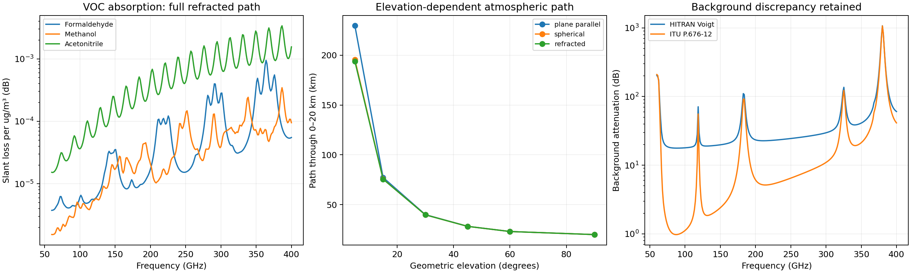
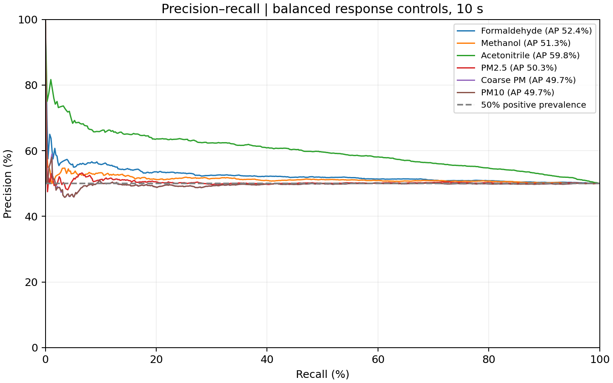
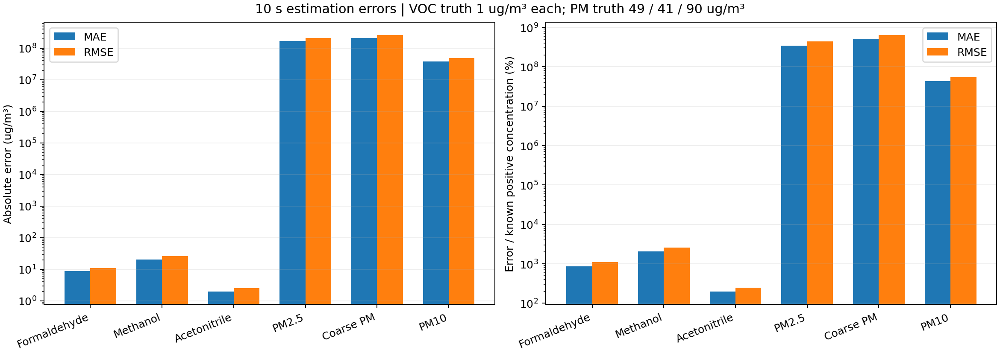
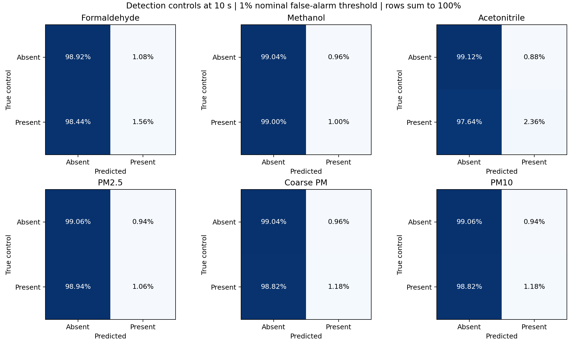
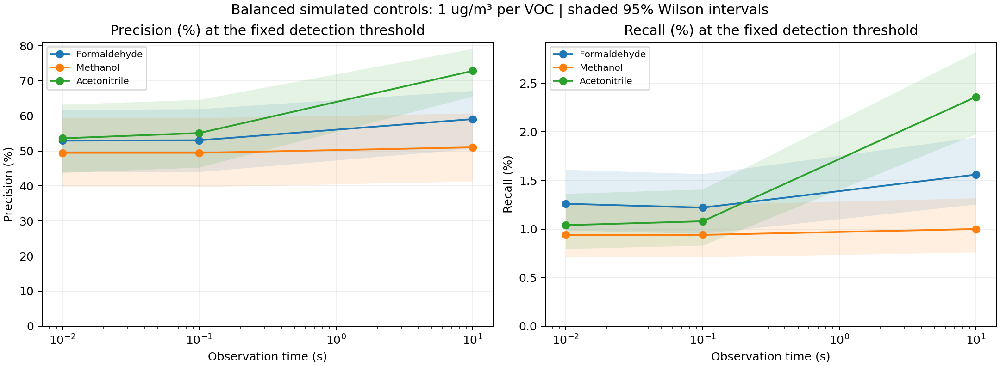
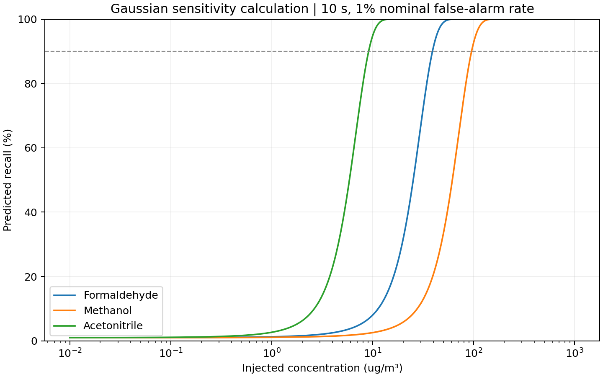

# Task 1.3: stratified path integration and detection/error reporting

Started: 2026-09-22; updated: 2026-09-23. This extends the [first VOC/PM/capacity study](36_voc_joint_pm_capacity.md). The user clarified that “1.3” means the proposal task, not a HAPI version. All evaluated frequencies remain **60–400 GHz**.

## Requirement and implementation

The controlling [proposal, page 1](../I2R_proposal_THz_ISAC%20(1).pdf) states: “Implement an atmospheric line-shape profile (Voigt/Lorentz) to integrate molecular absorption along a vertical slant path determined by the satellite elevation angle.”

The historical implementation used 24 midpoint layers and scaled the completed zenith column by a plane-parallel secant factor. The new implementation evaluates local absorption along the actual path through a spherical, refracting atmosphere. The full numerical requirement now has explicit implementations and acceptance checks:

| Component | Implementation | Acceptance evidence |
|---|---|---|
| Molecular line shapes | Temperature-dependent HITRAN strengths, TIPS-2025, Voigt Doppler/pressure widths, selectable Lorentz profile and pressure shifts | Multiple-state HAPI Voigt and explicitly sign-adapted HAPI Lorentz comparisons; independent pressure-shift check |
| Air and self broadening | Local H2O/O2 fractions; trace-gas derivatives evaluated at zero additional abundance | Mixture comparison with HAPI; self-broadening unit tests |
| Altitude-dependent state | Continuous lapse-rate/isothermal T/P and exponential water/pollutant number densities through 20 km | State evaluated at each integration node; profile and weights exported |
| Actual satellite path | Spherical geometry and a refractive boundary-value solution connecting ground and satellite coordinates | Analytic straight-shell chord, vacuum and zenith limits, independently integrated refracted path and endpoint |
| Absorption integral | Gauss-Legendre integration of local cross section times molecular number density along the ray | Full 256-frequency convergence study with 1, 2 and 4 points per layer |
| Elevation and line-shape comparisons | 5°, 15°, 30°, 45°, 60°, 90°; plane-parallel, spherical and refracted paths; Voigt versus Lorentz | Saved geometry, line-shape and background tables |
| Downstream use | New refracted absorption arrays feed the joint VOC/PM estimator and capacity check | Saved input hashes and independently replayed concentration/detection metrics |

The code is in [slant_path.py](../src/thz_isac/slant_path.py), [stratified_absorption.py](../src/thz_isac/stratified_absorption.py) and the extended [physical_spectroscopy.py](../src/thz_isac/physical_spectroscopy.py). Historical callers keep their original default behavior.

## How the integration works

At each altitude, the gas absorption coefficient is the sum of line strength times Voigt or Lorentz profile, multiplied by molecular number density. Optical depth is the integral of that coefficient over physical ray length; multiplication by `10/ln(10)` converts optical depth to attenuation in dB. Units are carried from cm²/molecule and molecules/cm³ to inverse meters before path integration.

The Lorentz half-width uses `p * [(1-q) gamma_air + q gamma_self] * (296/T)^n_air`, where `q` is the local self mole fraction and pressure is in atmospheres. Standard downloaded HITRAN records do not supply `n_self` or `delta_self`; the explicit fallback uses `n_air` for self width and zero self shift, matching HAPI's fallback. No missing self parameters are presented as measured. Trace VOC columns are local derivatives at zero added concentration, which is consistent with the downstream linear estimator.

The spherical ray uses the invariant `b = n(r) r sin(zenith angle)`. The integral has `ds/dr = n(r)r / sqrt((n(r)r)^2 - b^2)`. A root solve chooses `b` so that the atmospheric path plus the exterior path reaches the satellite specified by its altitude and **geometric** elevation. Apparent receiver elevation is an output, not silently substituted for geometric elevation. A turning or nonescaping ray is rejected.

Refractivity follows the radio formula documented by [ITU-R P.453](https://www.itu.int/rec/R-REC-P.453/en) and the [implementation reference](https://itu-rpy.readthedocs.io/en/latest/apidoc/itu453.html). The supplied profile is spherically symmetric and nondispersive. Beyond the modeled 20 km column, propagation is treated as vacuum. These are declared atmospheric-model boundaries, not claims that real air ends at 20 km. Full three-dimensional weather, frequency-dependent dispersive bending, ducting and measured vertical composition remain outside this reference model.

## Numerical results and checks

At 45° geometric elevation the apparent elevation is 45.01742°, and the atmospheric path through the modeled 0–20 km column is 28.2371 km. At 5°, the secant path is 229.474 km, the straight spherical path is 195.440 km, and the refracted path connecting the same satellite is 193.779 km. Thus curvature matters most near the horizon; the solver does not use a constant elevation multiplier.

The main calculation uses 40 layers with two quadrature points each. Four points per layer change the combined gas spectrum RMS by 0.000211%, PM by 0.001436%, HITRAN background by 0.0000631%, and ITU background by 0.0000511%. The 0.1% convergence criterion was declared in the experiment script. These errors concern altitude integration of this model, not accuracy against real atmospheric measurements.

The initial reference check exposed a **pressure-shift sign discrepancy in the installed HAPI 1.3 Lorentz routine**. Its `PROFILE_LORENTZ` uses `WnGrid + Delta0 - Nu`, centering the line at `Nu - Delta0`. The [HITRAN definition](https://hitran.org/docs/definitions-and-units/) centers it at `Nu + delta*p`, as does this project's forward model. Six CO/water Lorentz comparisons failed, with maximum discrepancy 5.59%. Those [initial failures](../results/task_1_3/hapi_initial_comparison.csv) remain available.

The final Lorentz comparison explicitly adapts the reference routine's shift sign. It does not alter the research absorption formula or installed HAPI package. The [sign probe and installed-source hash](../results/task_1_3/hapi_pressure_shift_sign.json) record this choice; a separate isolated-line test checks peak location and Lorentz peak height directly from the HITRAN definition. Voigt comparisons use unmodified HAPI. The final reference table labels the adapter in every Lorentz row, so this is not presented as agreement with the unmodified Lorentz routine.

All **54 reference cases pass** after that documented reference correction; the largest peak-normalized difference is 6.752 × 10⁻⁶. The complete repository test suite passes **167 tests**. Independent artifact verification also passes: 45 hashes, 36 detection rows, 72 error rows, frequency limits and communication accounting. The separately retained earlier comparison study passes its 99-hash verification.

Evidence:

- [Reference altitude, state and ray weights](../results/task_1_3/reference_path.csv).
- [Elevation and geometry comparison](../results/task_1_3/elevation_geometry.csv).
- [Quadrature convergence](../results/task_1_3/quadrature_convergence.csv).
- [Voigt versus Lorentz](../results/task_1_3/line_shape_comparison.csv).
- [HAPI comparison at 0, 6 and 18 km](../results/task_1_3/hapi_multistate_validation.csv).
- [Run summary and limitations](../results/task_1_3/summary.json), [provenance manifest](../results/task_1_3/manifest.json).



## Precision, recall and concentration errors

Detection and estimation answer different questions. Precision is `TP/(TP+FP)` and recall is `TP/(TP+FN)` for a declared presence decision. Concentration accuracy is measured separately with bias, MAE, RMSE, 95th-percentile absolute error and interval coverage. Percentage MAE/RMSE divide by the known positive concentration. They are undefined for the absent controls rather than silently divided by an epsilon.

The evaluation has 5,000 independent positive and 5,000 absent complex-pilot responses per scenario. Each positive response contains 1 µg/m³ of each VOC and the recorded PM pair from the earlier study: fine=49, coarse=41 and PM10=90 µg/m³. Each absent response has zero target concentrations. Thus the positive class prevalence is **50% by design**. It is an instrument-response control, not an atmospheric prevalence estimate or a population benchmark. Precision and average precision must be interpreted in that context.

The detector uses the **signed** GLS estimate divided by its conditional standard error, with a fixed one-sided 1% nominal per-target false-alarm threshold. The threshold is set analytically before the response controls are scored. This is a per-target decision rule, not a family-wise 1% false-alarm guarantee across all pollutants. Wilson 95% intervals accompany precision, recall and false-positive rates. Negative concentrations remain in error calculations; nonnegative clipping is not used to manufacture detections.

Scenarios cover 0.01, 0.1 and 10 seconds with zero and 0.001 dB persistent per-tone residual standard deviation. Positive and absent controls have independent draws. Scenarios reuse underlying draws to make duration/residual comparisons paired. The same 30 existing pilots per 10,000-symbol frame and communication-optimal power allocation are used throughout; no extra sensing pilots are added.

At 10 seconds with zero residual floor, the results are:

| VOC | Precision (95% interval) | Recall (95% interval) | False-positive rate | RMSE (µg/m³) | RMSE / 1 µg/m³ truth |
|---|---:|---:|---:|---:|---:|
| Formaldehyde | 59.09% (50.56–67.11%) | 1.56% (1.25–1.94%) | 1.08% | 10.962 | 1,096.2% |
| Methanol | 51.02% (41.27–60.69%) | 1.00% (0.76–1.32%) | 0.96% | 26.063 | 2,606.3% |
| Acetonitrile | 72.84% (65.52–79.10%) | 2.36% (1.97–2.82%) | 0.88% | 2.508 | 250.8% |

These recall values do **not** demonstrate useful detection at 1 µg/m³. Average precision is 52.43%, 51.31% and 59.77%, respectively, against the 50% positive-prevalence baseline. PM average precision is approximately 50%, and PM2.5/PM10 RMSE is 2.131 × 10⁸ / 4.846 × 10⁷ µg/m³. The huge signed-estimator errors retain the negative joint-PM result instead of hiding it with bounds or clipping.

The communication reference and sensing-reuse policy both give **814.056 Mbit/s** under the selected atmospheric model: **0% incremental modeled rate loss**, 23 dBm total power and no additional sensing pilots. The modest difference from the earlier 816.936 Mbit/s reference arises from the updated atmosphere/path calculation; those absolute rates compare different propagation models and should not be interpreted as an incremental sensing cost.

Artifacts:

- [Precision, recall, F1, false-positive rates, average precision and confidence intervals](../results/task_1_3_metrics/detection_metrics.csv).
- [Absolute and percentage concentration errors, coverage and negative-estimate percentages](../results/task_1_3_metrics/concentration_errors.csv).
- [Full stored signed estimates for replay](../results/task_1_3_metrics/control_estimates.npz).
- [Protocol, truth, class balance, threshold and communication contract](../results/task_1_3_metrics/protocol.json).
- [Independent verification](../results/task_1_3_verification.json).











The concentration sweep in the last plot is a conditional Gaussian sensitivity calculation with fixed covariance, not measured abundances or additional independent test cases. At large concentrations, nonlinear attenuation and concentration-dependent noise would need separate validation. PNG and SVG copies of the metric plots are provided for inspection and reuse.

## Completion boundary, risks and next work

Task 1.3 now has the requested numerical line-shape and slant-path implementation, with spherical/refraction extensions and explicit convergence/reference checks. That computational closure does not close physical validation. The unbounded HITRAN line-wing background and the ITU-R P.676-12 background still disagree substantially. The current ITU library does not implement P.676-13. The background used for the reported retrieval metrics is therefore named explicitly, and favorable precision or capacity values must not be presented as robust field performance.

Joint fine/coarse PM remains a weak and highly correlated signal under assumed aerosol optical properties. Unknown smooth calibration terms can make it unidentifiable. Implementing a more complete path integral does not add an independent PM observable. Measured VOC labels, calibrated radio CSI, atmospheric profiles and PM optical data are still needed to test the actual monitoring claim.

Next steps are to resolve the microwave line-wing/continuum model against a validated reference and measured profiles, then evaluate calibrated detection thresholds and error distributions on genuinely held-out measurements. A field precision/recall claim requires such a labeled test set. Communication throughput must also be checked on a realizable waveform and radio; the present contract verifies zero incremental loss inside the declared Shannon-rate model.

## Reproduction

Use the environment and downloads described in [the acquisition note](36_voc_joint_pm_capacity.md). From the repository root:

```powershell
python scripts/run_task_1_3.py
python scripts/evaluate_retrieval_metrics.py
python scripts/verify_task_1_3_results.py
python -m pytest -q
```

The first command evaluates all profile/convergence cases and may take several minutes on a CPU. The metric command requires the completed absorption manifest and checks its input hash before proceeding. The verification command independently recomputes confusion counts, error denominators and communication rate from saved samples and arrays.

`python scripts/run_task_1_3.py --resume-integration` can reuse the completed integration checkpoint while rerunning reference checks. It verifies the saved spectra, convergence/geometry tables, spectroscopic input and physics-module hashes first. The initial source snapshot and failed-reference attempt are retained; the resumed manifest's runtime covers reference validation and reporting, not the earlier integration work.
