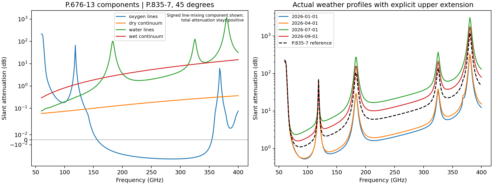
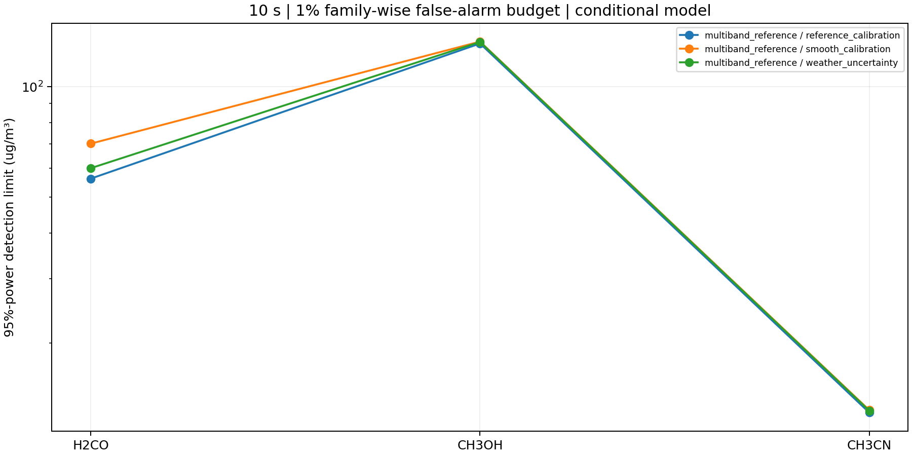
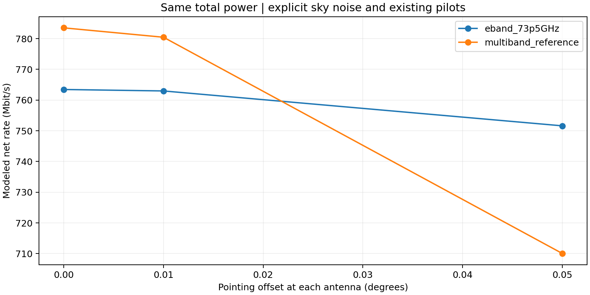
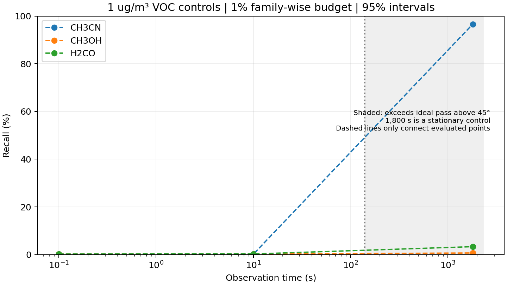

# Completion work on proposal tasks 1.1, 1.2, 1.3, 1.4, 2.1, 3.1, 3.2 and 4.3

Date: 2026-09-23. Scope: evaluated radio frequencies are **60-400 GHz**. This report supersedes implementation gaps in the earlier [task 1.3 report](37_task_1_3_and_detection_metrics.md), while preserving its experiment records. Numerical model completion, a negative feasibility finding, and measured sensor validation are different outcomes.

**Current conclusion:** all eight requested tasks received implementation and validation work, but the research programme is **not fully completed**. Atmospheric/path numerical checks now pass; the expanded model still does not demonstrate useful joint PM retrieval or measured VOC sensing. Communication pilot reuse preserves the modeled rate under the declared resource contract. The dedicated [0.116% thermal convergence audit](39_thermal_convergence_audit.md) records the correction, unchanged 0.1% tolerance and separate statistical-threshold change.

This Markdown report and that audit contain the methods, reasoning, results, failed cases, limitations and next steps. CSV/JSON/NPZ files provide the linked numerical evidence; understanding the conclusions does not require reading those formats. Earlier [VOC/PM work](36_voc_joint_pm_capacity.md), [task 1.3 work](37_task_1_3_and_detection_metrics.md) and the [historical task ledger](25_research_task_completion_status.md) remain available.

## What changed and why

### 1.1: reference and measured atmospheric profiles

[atmospheric_profiles.py](../src/thz_isac/atmospheric_profiles.py) implements **ITU-R P.835-7 Annex 1 through 100 km**, including the geometric/geopotential height conversion, seven lower-atmosphere temperature regimes, the upper-atmosphere pressure/temperature formulae and the stratospheric water mixing-ratio floor. The former 20 km truncation is now an explicit comparison rather than the primary reference atmosphere.

The [NOAA IGRA archive](https://www.ncei.noaa.gov/products/weather-balloon/integrated-global-radiosonde-archive) supplies actual Beijing pressure, temperature, geopotential height and dew-point depression. The parser rejects missing and quality-control-removed values, retains quality flags, converts heights, and reconstructs water partial pressure from reported dew point. It retained **103,322 levels from 521 soundings** in the acquired 2026 station file. Four soundings were selected by a fixed date rule before spectral evaluation: the first complete profile reaching at least 20 km in January, April, July and September. Their measured tops range from 28.8 to 37.0 km above the station.

Measured levels are interpolated in temperature and log pressure/vapour. Above the last observed level, an explicitly named model joins continuously to the reference atmosphere: hydrostatic pressure, a decaying temperature offset and a joining water mixing ratio. The upper continuation is not labelled measured data. Files: [selection and exclusions](../results/task_completion/weather_selection.json), [weather-dependent attenuation](../results/task_completion/measured_weather_attenuation.csv), [measured-weather VOC integrations](../results/task_completion/measured_weather_voc_summary.csv).

**Remaining:** the soundings constrain weather, not vertical VOC/PM abundances. Gas and PM concentration scale heights remain declared assumptions. Four selected soundings illustrate seasonal variability; they do not estimate a population distribution, and their 2026 weather is not paired with the historical PM station row or a radio observation. Horizontal homogeneity and nondispersive refraction remain model boundaries.

### 1.2: isotopic spectroscopy and unit conventions

The acquisition now requests every HAPI-listed isotopologue for the ten configured molecules. Existing main-isotope catalogues are reused, and additional isotope data are archived with source hashes. The [inventory](../results/task_completion/line_inventory.csv) reports in-band line counts and invalid-width checks. Line centres outside 60-400 GHz are retained only for their tails; no out-of-band sensing result is introduced.

The acquired inventory contains **34 isotope tables, 304,416 catalogue transitions and 31,474 in-band transitions**. This is the configured molecular catalogue/window, not a claim to have downloaded all HITRAN data.

Each isotope now uses its own molecular mass for Doppler broadening and its own partition sum. HITRAN intensities already include terrestrial abundance, so that abundance is **not multiplied a second time**. Twelve rare-isotope comparisons against unmodified HAPI Voigt pass at two thermodynamic states; see [reference checks](../results/task_completion/rare_isotope_hapi_validation.csv).

Natural-mixture mass concentrations use [CIAAW abridged atomic weights](https://ciaaw.org/abridged-atomic-weights.htm). Stored integration arrays retain the historical main-isotope mass convention; retrieval applies the exact `old_mass/natural_mass` column conversion before inference and uses natural-mixture masses for ppm. This conversion changes units without changing isotope line shapes. Its implementation and source are in [concentration_units.py](../src/thz_isac/concentration_units.py).

The [wing/isotope sensitivity table](../results/task_completion/isotope_and_wing_sensitivity.csv) keeps the effect of main-isotope-only calculations and finite line wings. Across the evaluated grid, main-isotope-only spectra differ from acquired-isotope spectra by approximately 1.2% for formaldehyde and CO, 0.66% for ozone and 5.2% for SO2. Truncating wings at 50 or 300 GHz still changes some spectra by several percent. These controls are not evidence that arbitrary Voigt far wings are experimentally correct.

The uncertainty audit retains the original six `ierr` and six `iref` codes for **31,474 in-band transitions**, with a [parameter-by-parameter inventory](../results/task_completion/spectroscopic_uncertainty_inventory.csv). HITRAN codes marked unavailable, default or estimated are not zero error bars. Line-parameter uncertainty remains separate from the conditional receiver-noise covariance; its missing probability distribution prevents an unconditional detection-limit claim.

**Remaining:** three requested isotope/window responses returned HTTP 404: CH4 isotope 4 and NO2 isotopes 2 and 3. The [raw response audit](../results/task_completion/spectroscopy_unavailable_responses.json) preserves that fact; unavailable data are not converted into zero absorption. Methanol/acetonitrile have only the isotope coverage exposed by the source metadata. Missing broadening parameters and uncertainties cannot be created by software. The acquisition script exits nonzero when source coverage is incomplete, with usable downloads retained.

### 1.3: slant-path integration and microwave background

The spherical refracted path solver now respects atmospheric layer and measured-profile interfaces and supports explicit integration edges. The reference integration reaches 100 km and is repeated at two quadrature orders. [Convergence](../results/task_completion/integration_convergence.csv) and [the contribution above 20 km](../results/task_completion/upper_atmosphere.csv) are exported.

The initial thermal-emission comparison failed its declared 0.1% tolerance (0.116% change). That attempt is retained in [initial_integration_convergence.csv](../results/task_completion/initial_integration_convergence.csv). Refining the radiative-transfer grid to 100 m below 20 km and 500 m above it reduces the brightness-temperature difference to **0.00319%**, without recomputing converged molecular spectra. Final relative RMS changes are **0.00381% gas, 0.0225% PM and 0.00200% background attenuation**. The [refinement script](../scripts/refine_task_completion_sky.py) retains the original arrays and saves the finer thermal grids for replay; the acceptance threshold was not relaxed.

The [dedicated audit](39_thermal_convergence_audit.md) defines the percentage, explains the thermal source-function resolution issue, independently checks the unchanged arrays/threshold and quantifies its small effect on rate. It distinguishes this numerical acceptance check from the stricter family-wise detector threshold introduced below.

The new [microwave_absorption.py](../src/thz_isac/microwave_absorption.py) directly implements **P.676-13 Annex 1**, using the 44 oxygen and 35 water rows extracted from Tables 1 and 2 of the archived [ITU specification](https://www.itu.int/rec/R-REC-P.676/en). Coefficient provenance is [recorded beside the data](../src/thz_isac/data/itu676_13_source.json). Oxygen interference, the dry continuum and water pseudo-line continuum are separated in the output. The equations/coefficient result agrees with the independent ITU-Rpy version-12 implementation at tested states because this Annex 1 formulation is unchanged; no version-13 approximate slant method is being claimed.

The P.676 background **replaces** HITRAN H2O/O2 in the current link calculation; adding both would double count absorption. Other trace species retain their explicit HITRAN line shapes. This addresses the missing microwave-background mechanisms in the former plain Voigt background. Agreement with the published reference is not local field calibration.

### 1.4: full particle scattering and size distributions

[aerosol_mie.py](../src/thz_isac/aerosol_mie.py) computes full homogeneous-sphere Mie extinction, scattering and absorption with `miepython 3.0.2`. Number distributions are integrated in log diameter and normalized by particle mass. Fine/coarse modes use separate dry aerodynamic size cuts with Stokes/Cunningham conversion; PM10 remains the sum of fine and coarse mass. Supplied hygroscopic growth and frequency-dependent wet material constants are supported with an explicit effective-medium assumption.

For comparison with the prior model, the study retains its uncalibrated refractive indices and densities, but uses declared truncated lognormal distributions. Doubling distribution quadrature has negligible numerical effect. The [particle controls](../results/task_completion/aerosol_controls.json) show Rayleigh-versus-Mie relative RMS differences of about **0.00086% for fine particles and 0.0201% for coarse particles**. Thus a full Mie solver does not, by itself, create a useful PM observable in this size/frequency regime.

**Remaining:** measured sub-THz optical constants, composition, shape, size distributions and humidity growth for the target aerosol. The inspected [Jena optical database](https://www2.astro.uni-jena.de/Laboratory/OCDB/) entries for amorphous MgSiO3 and room-temperature pyroxene stop near 500 micrometres, outside this study's 750-5000 micrometre wavelengths. Those data were not extrapolated into 60-400 GHz or substituted for Beijing aerosol measurements. The Mie controls remain exploratory, not a calibrated PM result.

The [HITRAN2024 aerosol inventory](https://hitran.org/data/Aerosols/Aerosols-2024/Aerosol_Readme_2024.pdf) was also checked. Its listed atmospheric dust, soot and mineral optical data do not cover the complete 60-400 GHz interval. The much broader ice dataset represents a different material and cannot close this PM calibration gap.

### 2.1: radio resources, atmospheric noise and capacity

[waveform_link.py](../src/thz_isac/waveform_link.py) adds explicit contiguous OFDM blocks, subcarrier spacing, cyclic prefix, pilot overhead, simultaneous RF-chain counts, antenna pointing and polarization losses. Receiver noise now combines atmospheric downwelling brightness from layer radiative transfer with receiver equivalent input noise. Noise figure is not applied twice. The radiation calculation uses Planck-equivalent antenna temperature.

Two different cases are retained: the original 256 widely separated reference probes and a **256 MHz contiguous OFDM block centred at 73.5 GHz**, with 1 MHz spacing and a 1/16 cyclic prefix. The latter lies within the 71-76 GHz space-to-Earth allocation shown by the [ITU allocation reference](https://www.itu.int/en/ITU-R/study-groups/Documents/ITU-R_Reference_Assist/Beta_Test_Version.html); this is an engineering example, not a licence or a coordination determination. The wide reference is still an ideal multiband information experiment.

Capacity checks compare sensing reuse against communication-only operation on the same channel, with identical power and required pilots. Pointing and residual carrier-frequency/phase errors have separate sensitivity tables. Orbital Doppler and ideal pass duration are reported. A stationary 1,800-second calculation exceeds a single ideal 550 km pass; it is excluded from continuous-pass claims.

**Remaining:** measured oscillator/antenna/RF response, real acquisition bands and tuning schedules, coding performance, Doppler/phase tracking, rain/cloud/availability modelling and actual spectrum coordination. The reported rates are conditional information-rate calculations, not measured radio throughput.

### 3.1: separation under nuisance uncertainty

The retrieval now audits target information after eliminating calibration and interfering gas signatures. Three policies cover the prior reference nuisance set, additional measured-weather background variations, and additional smooth instrument terms. Normalized singular values, surviving information fractions and weak combinations are retained in [identifiability.json](../results/task_completion/identifiability.json). A numerical prior or clipping cannot turn a failed rank check into a detection.

The narrow E-band example loses target information after nuisance elimination: **17 of 18 configurations fail the numerical audit**. One 1,800-second case with 0.001 dB correlated residual noise barely retains the PM direction, but its formal VOC limits are 2.92e10-2.32e13 ug/m3 and its PM limits are 1.85e18-9.94e18 ug/m3. Those values lie outside meaningful atmospheric/model interpretation. Its numerical rank pass is not useful concentration information, and it is outside a single pass. This does not establish that every E-band waveform is impossible. Broad reference results cannot establish a hardware-feasible implementation without the corresponding band/resource design.

### 3.2: exact nonlinear response and estimator diagnostics

[robust_retrieval.py](../src/thz_isac/robust_retrieval.py) supplements signed GLS with a bounded nonlinear fit of the exact Beer-Lambert complex pilot mean. Its noise likelihood acts on real/imaginary receiver samples. This removes the small-attenuation approximation from that fit. It assumes phase referencing by the communication receiver; unknown phase tracking is not silently solved.

The experiment retains 5,000 positive and 5,000 absent controls per evaluated configuration, with correlated persistent-error scenarios. Signed estimates are used for error and detection reporting. Nonlinear fits use a declared 0-1,000 ug/m3 domain and retain optimizer success and active bounds. Profile likelihood refits all other parameters at fixed formaldehyde or fine-PM values. A fit at a bound, or a flat profile, is not a confident concentration estimate.

Files: [nonlinear fits](../results/task_completion/nonlinear_fits.csv), [profile likelihood](../results/task_completion/profile_likelihood.csv), [errors](../results/task_completion/concentration_errors.csv), [weather mismatch](../results/task_completion/weather_mismatch_bias.csv). The last file is a linearized sensitivity diagnostic; enormous biases lie outside the local model's valid concentration interpretation.

### 4.3: detection limits with explicit error probabilities

The detector uses a 1% **family-wise** false-positive budget across six reported targets, with Bonferroni allocation, and asks for 95% detection power. It reports both the critical decision level and the concentration detection limit, in ug/m3 and ppm for gases. Under the declared Gaussian model,

`critical level = z_(1-alpha/6) * sigma + b`

`detection limit = [z_(1-alpha/6) + z_0.95] * sigma + 2*b`

where `b` bounds the concentration bias induced by a per-channel calibration error. The factor two covers opposite worst-case bias at the null and alternative. Persistent errors do not vanish with extra pilots. Exact complex-response controls check whether the local Gaussian prediction actually reaches the intended detection probability; a failed check is retained.

The preceding metrics study used 1% **per target**; the new family-wise rule allocates approximately **0.1667% per target**. This intentionally stricter decision rule is recorded rather than tuned on the test draws. It is unrelated to the unchanged 0.1% integration tolerance. See the [threshold history](39_thermal_convergence_audit.md#threshold-history-distinguish-numerical-and-detection-thresholds).

[Detection limits](../results/task_completion/detection_limits.csv), [response checks](../results/task_completion/detection_limit_response_check.csv), [precision/recall and confidence intervals](../results/task_completion/detection_metrics.csv) and the [protocol](../results/task_completion/retrieval_protocol.json) state the assumptions. Precision depends on the constructed 50% positive prevalence. These are instrument-response controls, not an environmental test population.

The [environmental comparison](../results/task_completion/environmental_comparison.json) records WHO ambient PM guideline averaging periods and the separate indoor formaldehyde guideline domain. A slant-column estimate is not an independently measured surface/indoor concentration. No continuous daily coverage, applicable methanol/acetonitrile ambient limit, or environmental compliance result is invented.

## Numerical results and their interpretation

### Atmospheric and spectroscopy checks

All four primary integration checks pass their unchanged 0.1% tolerance after the thermal refinement. The 12 additional rare-isotope HAPI reference cases pass; the largest peak-normalized discrepancy is approximately **7.70e-6**. HAPI shares the underlying HITRAN data, so this is an implementation comparison, not independent laboratory validation.

The four actual-weather VOC integrations retain the measured pressure/temperature/water profiles and explicitly modeled upper continuation. Across the four selected dates, the maximum versus minimum **peak** attenuation coefficient changes by **13.85% for H2CO, 15.49% for CH3OH and 9.84% for CH3CN**, computed as `100 * (largest_peak / smallest_peak - 1)`. These are seasonal examples with the same assumed pollutant scale height, not estimated population variability. The September profile's order-one/order-two comparison gives **0.05304%** relative RMS. Only September received that separate order comparison; all four use order two for their reported coefficients. No claim of four independently converged weather runs is made.

The measured-weather coefficient arrays retain the historical mass convention identified above. The seasonal peak ratios are invariant to the common species-specific conversion; absolute natural-mixture concentrations must use the conversion before inference.

### VOC limits and concentration errors

The following reference is **10 seconds**, the ideal broad multiband channel, reference nuisance calibration, zero persistent random residual and zero deterministic bias allowance. The detector controls a 1% family-wise false-positive budget over six targets. These are conditional model-response results; the three VOC concentrations are experimental injections, not measured Beijing VOC labels.

| VOC | Conditional 95%-power limit (ug/m3) | Limit (ppm at 288.15 K, 101325 Pa) | Exact-response recall at that limit | RMSE at a 1 ug/m3 injection | RMSE as % of injection |
| --- | ---: | ---: | ---: | ---: | ---: |
| Formaldehyde, H2CO | 56.2102 | 0.044264 | 95.16% | 12.4380 ug/m3 | 1,243.80% |
| Methanol, CH3OH | 131.2401 | 0.096846 | 95.40% | 28.7102 ug/m3 | 2,871.02% |
| Acetonitrile, CH3CN | 12.9412 | 0.007454 | 94.92% | 2.8267 ug/m3 | 282.67% |

The exact-response check uses 5,000 new complex-noise draws at each limit. All three lie within the declared one-percentage-point tolerance of the predicted 95% power. Their maximum target attenuation is 0.0196-0.0284 dB, consistent with a local sensitivity check. This validates those three modeled operating points; it does not validate all nuisance/bias scenarios or extreme PM limits.

At the much smaller declared positive controls, the same reference produces:

| Target | Positive control (ug/m3) | Precision | Recall | False-positive rate | RMSE (ug/m3) |
| --- | ---: | ---: | ---: | ---: | ---: |
| H2CO | 1 | 68.18% | 0.30% | 0.14% | 12.4380 |
| CH3OH | 1 | 52.63% | 0.20% | 0.18% | 28.7102 |
| CH3CN | 1 | 40.00% | 0.20% | 0.30% | 2.8267 |
| Fine PM / PM2.5 | 49 | 42.86% | 0.12% | 0.16% | 1.0483e8 |
| Coarse PM | 41 | 43.75% | 0.14% | 0.18% | 1.2865e8 |
| PM10 | 90 | 47.06% | 0.16% | 0.18% | 2.3827e7 |

Precision here uses an artificial **50% positive prevalence** and very few predicted positives; it is unstable and not a deployment predictive value. Each row has 5,000 positive and 5,000 absent draws. Wilson intervals, specificity, F1, average precision and full counts are retained in [detection_metrics.csv](../results/task_completion/detection_metrics.csv). Realized false-positive percentages fluctuate around the per-target nominal level; the statistical budget is not a guarantee for each finite sample. Error tables retain signed estimates, MAE, RMSE, bias, 95th-percentile absolute error and percentage denominators. Percentage error at zero truth is undefined and is left missing, not reported as zero.

There are **36 attempted configurations**: two bands, three nuisance policies, three durations and two residual levels. Eighteen broad cases and one numerically marginal E-band case produce metric tables; the other 17 retain their failure records. The resulting tables contain **114 detection rows, 228 error rows and 342 decision-limit rows**. These rows are not independent atmospheric field observations.

### Why full Mie and nonlinear fitting do not close joint PM retrieval

In the same broad 10-second reference, formal local 95%-power limits are **4.85e8 ug/m3 for fine PM, 5.96e8 ug/m3 for coarse PM and 1.10e8 ug/m3 for PM10**. These enormous extrapolated limits signal insufficient information; they are not attainable or physically validated aerosol concentrations. Fine and coarse signatures remain nearly redundant after nuisance removal.

All 20 nonlinear pilot fits report optimizer success, but fine-PM estimates reach a domain boundary in **100%** of those fits and coarse-PM estimates in **95%**. The first draw's fine-PM likelihood profile changes by only **0.01085 deviance units over the entire 0-1,000 ug/m3 grid**. A bounded optimizer returning a value therefore does not establish a PM measurement. Neither clipping nor a numerical prior is used to claim successful retrieval.

### Communication resource result

The fixed reference uses a 550 km orbit, 45-degree elevation, **23 dBm total power**, 0.50/0.30 m transmit/receive apertures, 6 dB receiver noise figure and 5 dB implementation loss. Both comparisons use 30 required pilots per 10,000-symbol frame. The E-band plan additionally accounts for its 1/16 cyclic prefix.

| Configuration | Modeled net information rate | Incremental rate loss from existing-pilot sensing reuse | Interpretation |
| --- | ---: | ---: | --- |
| 256 broad probes across 60-400 GHz | **783.5117 Mbit/s** | **0%** | Ideal simultaneous multiband reference; no complete RF band plan |
| 256 contiguous 1 MHz tones near 73.5 GHz | **763.4401 Mbit/s** | **0%** | Explicit 256 MHz, one-RF-chain OFDM example; useful joint sensing not demonstrated |

This result means reusing already-required pilots does not take additional modeled power, symbols or information rate. It is not a claim that arbitrary sensing optimization, extra pilots, processing hardware or real modem operation has no cost. Pointing and synchronization impairments affect both communication-only and sensing-reuse cases. Separate [pointing/resource](../results/task_completion/link_resources.csv) and [synchronization](../results/task_completion/synchronization_sensitivity.csv) tables retain those effects.

The ideal overhead 550 km pass lasts **139.73 seconds above 45 degrees** and **589.07 seconds above 5 degrees** under the stated nonrotating-Earth model. The 1,800-second constant-channel experiment is a stationary sensitivity control. It does not establish coherent integration for a real pass, revisit schedule or constellation.

## Plots and visual review

All four plots are available as PNG and SVG under `results/task_completion/`. They were visually inspected after generation. The final presentation correction retains negative values of the signed oxygen line-mixing component and labels observations longer than the ideal pass; the stored experiment samples and metric values were unchanged. [plot_manifest.json](../results/task_completion/plot_manifest.json) records the redraw inputs and outputs.



The left panel uses a symmetric logarithmic axis because the separated line-mixing term can be negative away from lines. This decomposition is algebraic; individual components are not all independent nonnegative absorption mechanisms. Total attenuation remains positive and agrees with the reference implementation. The right panel shows the seasonal measured-weather examples and their explicit upper extensions.



These are zero-bias, zero-persistent-residual 10-second VOC limits for the broad reference. The narrow-band 10-second cases failed identifiability and consequently have no limit curve. Connecting the three species is a visual aid, not an interpolation between molecules.



Pointing loss reduces achievable rate even though incremental sensing-reuse loss remains zero relative to communication on the same impaired channel.



The recall plot includes 95% intervals and shades times beyond the ideal pass above 45 degrees. Dashed lines connect only the three evaluated durations. The long-duration acetonitrile result must not be presented as single-pass performance.

## Updated status of the eight requested tasks

| Task | Completed in this implementation | Evidence outcome | Remaining completion boundary |
| --- | --- | --- | --- |
| 1.1 Atmosphere | P.835-7 to 100 km; real IGRA weather ingestion and explicit upper continuation | Standard checks pass; seasonal coefficients computed | Observed pollutant vertical profiles, horizontal structure and broader weather validation |
| 1.2 Spectroscopy | Acquisition inventory, isotope-specific masses/partition sums, units, wing and uncertainty audits | 34 acquired tables; 12 additional HAPI comparisons pass | Three unavailable isotope responses and incomplete physical parameter uncertainty; independent laboratory comparison |
| 1.3 Voigt/path integration | Full Voigt trace lines, spherical refracted quadrature, P.676-13 microwave background, thermal transfer | All declared reference convergence gates pass after retained thermal failure/fix | Measured slant transmission/brightness and validation beyond selected states/geometries |
| 1.4 PM optics | Full Mie, normalized size distributions, aerodynamic cuts, supplied wet-growth interface | Mie converges; PM information remains insufficient | Target-specific optical constants, particle shape/composition/size and calibrated humidity growth |
| 2.1 NTN link | Explicit OFDM resources, antenna/receiver noise, pointing/polarization, synchronization controls and pass duration | Same-resource sensing reuse preserves modeled rate | Real RF response/bands, tracking, coding, weather availability and actual coordinated deployment |
| 3.1 Spectral isolation | Nuisance projection, measured-weather background basis and rank/weak-mode audit | 17 E-band cases rejected; all failures retained | Measured instrument/background response and a practically informative hardware band design |
| 3.2 Estimation | Exact nonlinear complex-amplitude fit, signed-error controls, active-bound and likelihood diagnostics | Numerical fits work; PM boundary/flat-profile failure exposed | Paired observations and held-out retrieval with calibrated covariance and phase tracking |
| 4.3 Detection floors | Explicit family-wise false-positive budget, 95% power, deterministic bias allowance, ppm and averaging-domain checks | Three reference VOC LOD response checks pass conditionally | Unconditional parameter uncertainty, environmental test prevalence, coverage and matched-period measured validation |

No software change can manufacture the missing measurements or make a negative identifiability result positive. The completed implementations and negative findings are useful research outcomes, but **none of the eight tasks should be described as fully field-validated**.

## Verification, reproducibility and completion boundary

The [independent verifier](../scripts/verify_task_completion.py) recomputes confusion counts, RMSE/percentage denominators, zero-bias detection limits, resource accounting and integration differences from stored arrays. It also checks identical original/final thermal tolerances, exact preservation of other arrays and an independent recursive radiative-transfer replay. The full repository suite passes **191 tests**; [the test record](../results/task_completion/final_pytest.txt) retains the result. The final [verification record](../results/task_completion/verification.json) and [completed-artifact manifest](../results/task_completion/completion_manifest.json) are the authoritative snapshot and include hashes of this report and the thermal audit. Earlier per-stage manifests may include files that were still being produced concurrently, or the earlier plot version; runtime logs are excluded from the final output hash set. Preserved historical manifests are hashed as historical evidence, not silently updated.

From the repository root, in the environment described in the [acquisition report](36_voc_joint_pm_capacity.md):

```powershell
$env:PYTHONPATH="$PWD\src;$PWD\scripts;$PWD"
python -m pip install -r requirements-voc-pm.txt
python scripts/acquire_task_completion_inputs.py
# Inspect the retained manifest if the source reports unavailable isotope data.
python scripts/validate_task_completion_spectroscopy.py
python scripts/audit_spectroscopic_uncertainties.py
python scripts/run_task_completion_physics.py
# The initial thermal convergence gate intentionally exits nonzero if unmet.
python scripts/refine_task_completion_sky.py
python scripts/run_measured_profile_voc.py
python scripts/run_task_completion_retrieval.py
python scripts/run_task_completion_retrieval.py --plots-only
python scripts/verify_task_completion.py
python -m pytest -q
```

Full isotope/path integrations can take tens of minutes on a CPU. The acquisition ledger explicitly identifies failed requests; source absence cannot be repaired by pretending no transition exists. Standard-reference results and measured-weather calculations retain their own provenance.

The work expands the computational implementation of all eight requested tasks. It does **not** close the physical validation of pollutant profiles, PM material properties, simultaneous RF acquisition, instrument calibration or environmental detection performance. Remaining work requires suitable measurements and hardware constraints. The next research step is a paired, calibrated atmospheric transmission experiment with independently measured gas/PM concentrations and weather, followed by a genuinely held-out detection evaluation. These requirements are not replaced by successful software tests.

To progress in order: obtain suitable aerosol optical/size measurements and pollutant vertical profiles; choose feasible simultaneous acquisition bands and measured hardware noise/phase response; collect paired transmission/concentration/weather observations; then repeat the saved inference and threshold protocol on held-out data. The current broad-band VOC limits can help design that experiment, while the PM and E-band failures constrain which claims it should attempt to test.
