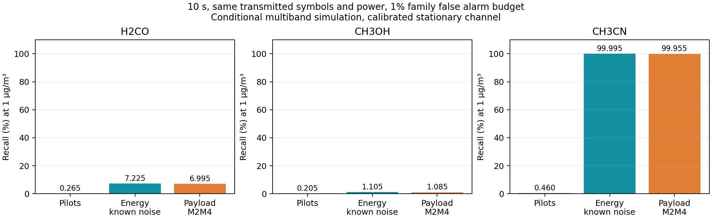

# Recall improvement by using the transmitted payload

September 27, 2026. This extends the [September 23 assessment](40_five_task_closure.md).

**Result:** Passive QPSK payload sensing substantially improves conditional VOC recall at unchanged transmission resources. At 1 µg/m³, 10 s and zero persistent calibration residual, acetonitrile recall increases from **0.460% to 99.955%**. Formaldehyde increases from **0.415% to 95.275%** at 100 s. Methanol and particulate sensing remain weak at that concentration. These are externally parameterized **simulated radio response results**, not measured atmospheric performance.

## What was done and why

The repository was fetched and pulled before this investigation. Both newest remote branches, `main` and `codex/five-task-closure`, pointed to `9a14b64`. Local `main` was fast forwarded from `1c1e6c1`. Five conflicting local manuscript/README/PDF files were preserved in stash commit `6b13a8113bb6ef26ae44cec9bcb985672965187d`, named `Preserve local September 8 manuscript before September 27 recall work`. Other existing modifications and untracked research files remained in place. The stash is intentionally retained rather than applying an old manuscript over the new one.

The original detector uses 30 pilots per 10,000 transmitted symbols. Even perfect nuisance knowledge gives a local Gaussian recall ceiling of only 2.948% for 1 µg/m³ acetonitrile at 10 s; formaldehyde and methanol ceilings are 0.270% and 0.213%. This is an information problem in the original experiment. A different regressor on those same independent pilot observations cannot supply the missing signal. Removing PM from joint estimation provides only modest VOC gains and would change the nuisance assumptions. [Oracle calculations](../results/payload_recall/information_ceiling.csv).

The useful intervention is to observe the existing payload. For constant modulus symbols, received power moments contain absorption information without knowing payload bits. This adds 9,970,000 usable payload symbols to a 10 s window that previously used only 30,000 pilots. The experiment conservatively uses payload alone for the new observable, so no pilot samples are counted twice. The improvement has an identifiable physical source and does not lower the decision threshold.

## What transfers from the Google paper

Batchu et al., [*Global monitoring of methane point sources using deep learning on hyperspectral radiance measurements from EMIT*](https://doi.org/10.1073/pnas.2612145123), PNAS 2026, uses spectral and spatial information jointly. Its 3.6 million physical plume simulations are injected into real radiance backgrounds. Dataset preparation and radiative transfer appear on physical pages 7–8; validation selection, spectral fit checks and real observation comparisons appear on pages 9–10. The paper reports 84% recovery of known EMIT plume complexes; the 96% landfill figure concerns a separate selected set, not general recall. [Google publication record](https://research.google/pubs/global-monitoring-of-methane-point-sources-using-deep-learning-on-hyperspectral-radiance-measurements-from-emit/).

The transferable lessons are to use available measurement information, retain physical injection, separate selection from evaluation, inspect false positives and test on real backgrounds. The current radio dataset has neither EMIT's image context nor paired atmospheric radio truth. Transferring its neural architecture or its recall percentage would be unjustified. This investigation first expands the observable using already transmitted samples; it does not claim to reproduce MAPL-EMIT.

Payload reuse itself is established ISAC research: Xu et al., [*Exploiting Both Pilots and Data Payloads for Integrated Sensing and Communications*](https://arxiv.org/abs/2506.15998), studies a different multiantenna problem. Second/fourth moment signal and noise separation is also established: [*On Asymptotic Efficiency of the M2M4 Signal-to-Noise Estimator for Deterministic Complex Sinusoids*](https://doi.org/10.3390/s21154950). The contribution here is its evaluated application to absorption retrieval, resource accounting and failure diagnosis, not invention of M2M4.

## Derivation from the received signal

For one frequency, let `y = sqrt(S) x + w`, where `|x| = 1` and independent circular Gaussian noise has `E|w|² = V`. Unknown symbol phase disappears from `|y|²`. Then

\[
M_2=E|y|^2=S+V,\qquad M_4=E|y|^4=S^2+4SV+2V^2,
\]
\[
S=\sqrt{2M_2^2-M_4},\qquad V=M_2-S.
\]

For `N` samples, the implementation replaces the squared sample mean with its cross sample unbiased estimate before taking the square root. This makes the estimator of `S²` unbiased; the square root and logarithm still have finite sample bias. Invalid inversions are retained as failures, never clipped into a valid signal.

The absorption observable is `A = -10 log10(S/Sref)`. With `s=S/V` and `k=10/ln(10)`, independently derived local variances are

\[
\operatorname{var}(\widehat A_{\rm pilot})\simeq k^2\frac{2}{N_p s},
\]
\[
\operatorname{var}(\widehat A_{\rm energy})\simeq\frac{k^2}{N}\left(\frac2s+\frac1{s^2}\right),
\]
\[
\operatorname{var}(\widehat A_{\rm M2M4})\simeq\frac{k^2}{N}
\left(\frac2s+\frac1{s^2}+\frac4{s^3}+\frac1{s^4}\right).
\]

The energy estimator requires known noise power; M2M4 estimates it. At the retained minimum SNR of 5 dB, its variance penalty relative to an oracle with known symbols is about 1.374 at equal sample count. The additional sample count dominates this modest penalty. The actual joint retrieval achieves approximately 17.8–18.0 times smaller thermal standard errors than pilots alone.

These variances feed the same signed joint GLS estimator, retaining all three VOCs, both PM components, background scale, gain offset and four interfering gases. Frequencies, transmit power and nuisance policies are unchanged. Six reported targets retain the same 1% nominal family false alarm budget and analytic Bonferroni threshold. No threshold or model is fitted to test labels. [Implementation](../src/thz_isac/payload_sensing.py), [frozen protocol](../results/payload_recall/protocol.json).

## Results

Each case has 20,000 independent present and 20,000 absent response draws. VOC concentrations remain 1 µg/m³; fine/coarse PM remain the earlier 49/41 µg/m³ example. Class prevalence is artificially 50%. Methods share deterministic seeds but consume different variates, so comparisons are not claimed to be paired Monte Carlo.

| Duration | VOC | Pilot recall | Payload M2M4 recall | Payload precision | Payload false positive rate |
|---|---|---:|---:|---:|---:|
| 10 s | Formaldehyde | 0.265% | 6.995% | 97.356% | 0.190% |
| 10 s | Methanol | 0.205% | 1.085% | 86.454% | 0.170% |
| 10 s | Acetonitrile | 0.460% | 99.955% | 99.815% | 0.185% |
| 100 s | Formaldehyde | 0.415% | 95.275% | 99.801% | 0.190% |
| 100 s | Methanol | 0.260% | 17.220% | 99.022% | 0.170% |
| 100 s | Acetonitrile | 3.330% | 100.000% | 99.815% | 0.185% |

This table assumes zero persistent residual and a calibrated stationary reference magnitude. Acetonitrile's 10 s recall Wilson interval is **99.914–99.976%**. The M2M4 family false alarm frequency is **0.920%**; this is a finite sample observation, not a new universal guarantee. Current pilot Monte Carlo values differ from the prior 5,000 sample run, while the standard errors reproduce the prior baseline exactly.

The 10 s conditional 95% detection limits improve from **56.210 / 131.240 / 12.941** to **3.150 / 7.288 / 0.723 µg/m³** for formaldehyde/methanol/acetonitrile. Curves at 1, 3 and 10 µg/m³ are separately labeled analytical sensitivity calculations. At a hypothetical 1% acetonitrile prevalence, nominal precision is approximately **85.83%**, rather than the 99.82% obtained with artificial balanced classes. Actual environmental prevalence is unknown. PM remains practically unobservable; reducing an error of order 10⁸ to 10⁶ µg/m³ is not a useful PM measurement.



[All detection counts and intervals](../results/payload_recall/detection_metrics.csv), [concentration errors](../results/payload_recall/concentration_errors.csv), [conditional concentration/prevalence curves](../results/payload_recall/conditional_curves.csv), [saved estimates/operators/covariances](../results/payload_recall/replay.npz).

## Checks against easier assumptions

**Finite reference:** An additional comparison charges 10 s for an independent reference and 10 s for sensing, for both pilot and payload methods. Acetonitrile enhancement recall is **0.380% with pilots and 93.800% with M2M4**. Total radiated energy is 3.991 J at 23 dBm. This removes the exactly known reference assumption but still assumes stable background and calibration between windows. It estimates enhancement; absolute concentration needs independently known baseline concentration. [Protocol and metrics](../results/payload_recall/finite_reference/detection_metrics.csv).

**Receiver noise error:** Assuming noise incorrectly makes the simpler energy method fail: a +1% error in actual noise power produces **22.5% false positives for formaldehyde**. M2M4's tested VOC false positive rates remain between 0.080% and 0.230% across ±1% noise stress. These cases keep nominal thresholds and thus test robustness rather than retuning. Unknown non-Gaussian noise or hardware distortion remains outside this result.

**Persistent calibration:** With the historical 0.001 dB correlated residual scenario, acetonitrile recall is only **33.310% at 10 s** and **48.700% at 100 s**. For arbitrary bounded spectral bias, robust thresholds at ±0.00001 dB retain 99.84% conditional acetonitrile recall; at ±0.0001 dB it drops to 15.03%. These are different uncertainty models, not interchangeable drift specifications. More payload cannot average away a persistent error.

**Weather held out:** Each of four measured weather profiles is excluded in turn from the nuisance basis and replayed as an unmodeled background. The resulting linearized acetonitrile bias ranges from −0.393 to +2.007 µg/m³. These fixed covariance diagnostics invalidate universal high recall under arbitrary weather; they do not constitute a new realistic detection prediction at a changed SNR.

**Modulation:** Applying the PSK formula to normalized 16-QAM gives **0.837 dB** false attenuation even with infinite data. Constant modulus per frequency is essential. QAM needs an appropriate moment or likelihood model and its own verification. OFDM's time domain envelope is not constant; moments are taken after the FFT on individual QPSK subcarriers.

**Practical band:** The existing 73.5 GHz contiguous radio remains unsuitable for the target. Even an unrealizable oracle with all other concentrations and background known gives only **1.256%** local acetonitrile recall with payload at 10 s. Strong broad reference results cannot be transferred to E-band. The 100 s stationary calculation is not a moving satellite experiment; geometry and gain must be normalized without removing the gas signal.

[All stress tests](../results/payload_recall/stress_tests.csv), [modulation failure](../results/payload_recall/finite_reference/modulation_mismatch.json), [information ceiling](../results/payload_recall/information_ceiling.csv).

## Verification and reproduction

Pilot means and known noise energy controls use exact complex Gaussian and noncentral chi square sampling. M2M4 controls sample the **joint asymptotic distribution of the two moments**, followed by their nonlinear inversion; they are not exact simulations of every payload symbol in every 10 s trial. This approximation is checked separately using **240 million raw complex QPSK symbols** across eight settings, including varying phase and a 10% noise change. At only 10,000 symbols per trial, variance ratios are 0.970–1.070 and no inversion fails. Main controls use 9.97 million or more symbols. This supports the approximation without converting simulation to measured evidence.

A separate 256 tone FFT/CP waveform checks actual modem decisions before and after sensing. All **5,104,640 payload bit decisions remain identical**, and received arrays are unchanged. The uncoded modem still makes 12,483 bit errors; sensing does not claim error free communication. Reading a payload does not add transmitted symbols, power or RF airtime, but it does add receiver processing. QPSK does not establish attainment of the older Gaussian input Shannon capacity calculation. [Raw validation](../results/payload_recall/raw_symbol_validation.csv), [waveform control](../results/payload_recall/waveform_control.json).

The independent verifier checks 436 identities, hashes, counts, variances, baseline values and resource facts. It replays 72 metric rows over 12 configurations. Six analytic/unit tests cover resource counting, signal/noise separation, an independent variance Jacobian, invalid inversions, response distributions and phase invariance. [Verification](../results/payload_recall/verification.json), [runtime/input manifest](../results/payload_recall/manifest.json), [tests](../tests/test_payload_sensing.py).

```powershell
python scripts/run_payload_recall.py
python scripts/verify_payload_recall.py
python scripts/check_payload_reference.py
python -m pytest -q
```

Install the existing `requirements.txt` and `requirements-voc-pm.txt` for the full test suite. The first full run found missing `miepython` and `itur` in the current Python environment; their already specified versions were installed. No spectral parameters or test expectations were changed to pass those dependency failures.

The final full suite passes **222 tests**. The updated seven page manuscript compiles without unresolved references or overfull boxes and has been visually reviewed. [Test output](../results/payload_recall/test_results.txt), [paper build](../results/payload_recall/report/paper_build.json).

## What remains and next steps

The new result establishes a useful conditional computational route for VOCs, especially acetonitrile. It does not establish a calibrated atmospheric monitor. The immediate experiment is QPSK transmission through a controlled gas path, with alternating reference windows, independent gas truth, recorded raw subcarrier observations and receiver settings. Evaluate pilot and M2M4 methods on the same held out acquisition. Measure spectral reference drift before claiming the required 10⁻⁵–10⁻⁴ dB stability.

An implementable multiband frequency plan, tracking over a changing path, measured background covariance, QAM extensions and gain/nonlinearity characterization remain necessary. Methanol at 1 µg/m³ and joint PM need additional physical information. Training a large neural model is premature until actual radio backgrounds and independent test labels exist; the Google paper's real background and physical validation steps are the relevant model for that next stage.
