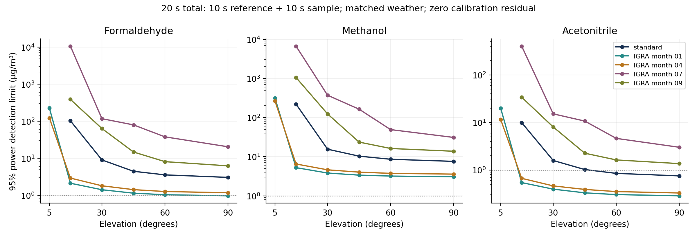
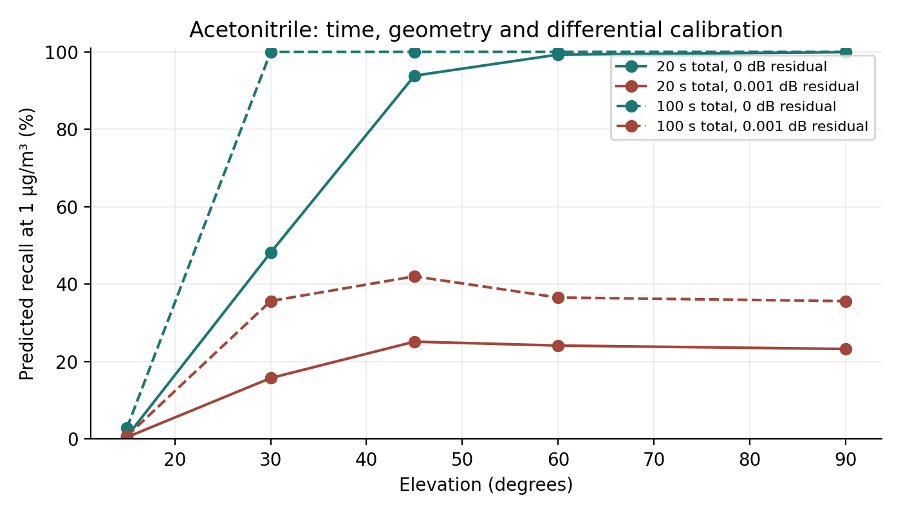

# Payload bounds, sensitivity and detection floors

> **Critical calibration assumption:** Favorable results assume zero residual calibration error after correction, an accuracy not established experimentally. With a charged 10 + 10 second reference/sample pair at 45° in the standard atmosphere, predicted acetonitrile recall at 1 µg/m³ falls from 93.84% to 25.17% at a modeled differential residual standard deviation of 0.001 dB. Receiver noise and finite reference uncertainty remain present. [Permanent note and exact evidence](46_critical_calibration_assumption.md).

## What was done and why

Original proposal Tasks 4.1–4.3 are extended to passive payload sensing. The study now distinguishes estimator variance from fundamental local information, charges finite reference acquisition, recomputes atmospheric and link physics across elevation and measured weather, and validates the predicted detection limits. The [derivation](44_payload_information_derivation.md) gives the likelihoods, nuisance treatment and scope.

The 21 recovered HITRAN isotope files match the previous raw data hashes exactly. Seven gas designs are recomputed over spherical refracted rays, using the standard atmosphere and four previously selected NOAA IGRA soundings. Background absorption, atmospheric emission, receiver SNR and communication water filling are recomputed per case. PM optics and assumed vertical profiles are retained. The 30 physical cases span 5°, 15°, 30°, 45°, 60° and 90°. Total durations are 2, 20 and 100 seconds, with equal sample and independent reference windows. Receiver noise multipliers are 1 and 2; differential calibration residuals are 0, 0.0001 and 0.001 dB.

## Main result

At standard atmosphere, 45°, 20 seconds total, nominal receiver noise and zero residual:

| Gas | 95% power limit (µg/m³) | Limit (ppm) | Simulated power at limit | Efficiency vs full QPSK CRLB |
|---|---:|---:|---:|---:|
| Formaldehyde | 4.456 | 0.003509 | 94.57% | 95.89% |
| Methanol | 10.307 | 0.007606 | 95.00% | 97.61% |
| Acetonitrile | 1.023 | 0.000589 | 94.99% | 96.49% |

The estimator is already close to the full constellation information bound. Replacing M2M4 with a more elaborate likelihood estimator offers a small improvement in this case; it cannot plausibly remove the large methanol or PM limitations. The comparison includes unknown noise, finite reference, all three VOCs, both PM modes, and six spectral nuisance coefficients.

The quoted ppm values use the local surface pressure and temperature and natural mixture molecular masses. They express the assumed exponential column profile as a surface equivalent concentration enhancement. They are not directly measured ground level concentrations or absolute concentrations without baseline truth.

## Operating region and validation

27 of 30 physical cases meet the fixed 5 dB / 20 usable tone gate at nominal receiver noise. Every eligible case has 10,000 independent null responses and 10,000 responses for each VOC at its predicted limit. Across 81 VOC controls, measured power ranges from 94.54% to 95.39%; per target false positive frequency ranges from 0.07% to 0.26%. All power checks pass their fixed Monte Carlo tolerance. Counts, exact binomial confidence intervals and retained response arrays are available for replay. The threshold is fixed for a 1% family error budget across six outputs. No test outcomes choose it.

The response limit is solved using concentration dependent sample variance before testing. This corrects the local Gaussian limit without changing the null threshold. Moment draws are asymptotic sample moment responses followed by nonlinear inversion, supported by the earlier independent raw QPSK experiment. They are not full multi-million-symbol waveform simulations.

At 20 seconds and zero residual, acetonitrile limits over the eligible weather/elevation grid span 0.287–400.598 µg/m³. Weather is supplied to the estimator in these cases. This is a matched weather sensitivity study, not robustness to unknown weather; the earlier weather mismatch failures remain valid.

Rejected cases, including doubled noise: standard_05 (noise ×1, 0 usable tones), standard_05 (noise ×2, 0 usable tones), igra_01_05 (noise ×2, 0 usable tones), igra_04_05 (noise ×2, 0 usable tones), igra_07_05 (noise ×1, 0 usable tones), igra_07_05 (noise ×2, 0 usable tones), igra_07_15 (noise ×2, 0 usable tones), igra_09_05 (noise ×1, 0 usable tones), igra_09_05 (noise ×2, 0 usable tones), igra_09_15 (noise ×2, 17 usable tones). These are retained failures of the declared operating gate. Their absence from plotted curves does not mean zero detection limit.

The residual is the standard deviation of the *differential* correlated dB error after reference subtraction. It is therefore added once. It is a zero mean random sensitivity scenario, not a bound against arbitrary systematic drift. Previous bounded bias controls remain relevant.

## Changing geometry

For an ideal 550 km overhead circular pass, local information is integrated along the time dependent ray and link, with independent nuisance coefficients per time block and shared concentration. A matched reference pass is charged the same transmission time. Both passes require the same atmosphere and accurate instantaneous gain normalization. Orbital waiting time is excluded. Doubling midpoint resolution from 20 to 40 blocks changes standard deviations by less than 0.05%.

| Center elevation | Total reference + sample time (s) | Acetonitrile local 95% limit (µg/m³) |
|---|---:|---:|
| 45° | 20 | 1.027 |
| 45° | 100 | 0.458 |
| 90° | 20 | 0.753 |
| 90° | 100 | 0.342 |

These are conditional information/estimator variance calculations along a moving geometry. They do not implement Doppler tracking, synchronization, orbit uncertainty or a raw moving waveform receiver. Those requirements remain in Task 2.2.

## Environmental guideline assessment

The [WHO 2021 guidelines](https://www.who.int/publications/i/item/9789240034228/) concern PM2.5, PM10, O3, NO2, SO2 and CO. They do not supply a benchmark for methanol or acetonitrile. The [WHO formaldehyde guideline](https://www.who.int/teams/environment-climate-change-and-health/air-quality-and-health/health-impacts/types-of-pollutants) is 100 µg/m³ averaged over 30 minutes in its indoor air quality context. It is not an outdoor satellite path threshold. A modeled formaldehyde detection limit below that number does not establish applicable compliance.

The WHO PM2.5 and PM10 24 hour levels are 15 and 45 µg/m³. Their averaging period and ground level exposure domain differ from a seconds long slant column enhancement. PM mass information remains impractical and composition is uncalibrated. The WHO guidelines are health recommendations, not a universal legally binding certification rule. No positive compliance conclusion is supported.

## Verification and reproducibility

Run `scripts/acquire_payload_spectroscopy.py`, `scripts/run_payload_physics.py`, `scripts/run_payload_bounds.py`, `scripts/check_payload_moving_geometry.py`, `scripts/check_payload_thermal.py`, `scripts/verify_payload_bounds.py`, and `scripts/report_payload_bounds.py`. The experiment may run concurrently with physics production; it cannot pass until the final physics manifest and every consumed hash match. Input acquisition preserves the historical manifests. Layer caches carry input fingerprints and refuse silent reuse after inputs change.

The new unit tests check quadrature convergence, information ordering, independent density derivatives and the joint Fisher inverse for a finite reference. The numerical verification checks saved response counts, resource budgets, units, estimator constraints, efficiency and output hashes. Original spectroscopy acquisition gaps remain excluded; matching the recovered files does not fill missing catalog requests.

## Remaining work, risks and next steps

Tasks 4.1 and 4.3 now have the requested computational extension; Task 4.2 has fixed and moving geometry sensitivity under the explicitly stated calibration assumptions. Positive environmental compliance and field performance remain unverified. The main remaining engineering work is a realizable multiband resource design and moving receiver implementation, Tasks 2.1 and 2.2. The ideal 60–400 GHz simultaneous tone reference still lacks that architecture. The unfavorable contiguous E-band result remains unchanged.

The scientific priority is to obtain more useful spectral information while preserving communication resources, then test gain/reference stability on measured transmissions with independent concentration truth. PM and weak methanol performance remain open for Tasks 3.1 and 3.2. More Monte Carlo trials or a neural network alone cannot establish information absent from the signal model.
