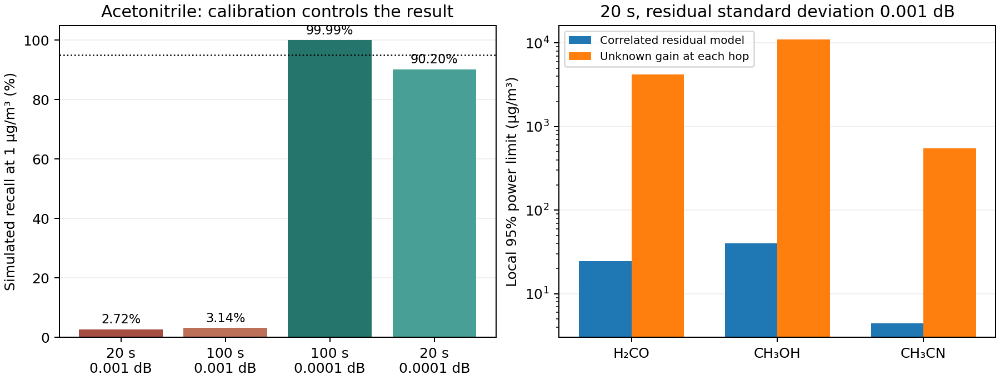

# Receiver design, moving payload and calibration requirements

September 27, 2026. This is a follow-up to the [proposal audit](43_original_proposal_remaining_tasks.md) and the [critical calibration note](46_critical_calibration_assumption.md).

**The new favorable control uses a nonzero assumed calibration residual, not a measured calibration accuracy.** In the standard atmosphere at 45 degrees, with matched reference weather, 23 dBm radiated power and a 6 dB receiver noise figure, acetonitrile recall at 1 µg/m³ is 99.99% in 10,000 simulated responses with 100 seconds total and residual standard deviation 0.0001 dB. At 0.001 dB it is only 3.14%. Neither is field performance. The original zero residual benchmark remains an idealization.

## What was done and why

The missing link between separated ideal tones and an actual modem was made explicit. A contiguous candidate was screened, its exact spectrum was recomputed, and its failed joint identifiability was retained. A second candidate uses one active RF chain sequentially across 16 blocks within the 220–330 GHz WR3.4 family. Each block has 16 QPSK tones, 1 MHz spacing and a one sample cyclic prefix. Centers run from 228 to 316 GHz. A frame has 10,000 symbols and 30 existing pilots. This is 16 MHz instantaneous bandwidth, an 88 GHz tuning span and a 1.0625 µs symbol duration.

The reference and sample each use 10 seconds in the 20 second control. Charging 1 ms settling per hop and complete frames leaves 19.72 seconds of transmission and 0.032 seconds of settling. The remainder is frame rounding. Total radiated power is 23 dBm while transmitting, not 23 dBm per simultaneous block. Both transmissions carry ordinary coded communication data. Waiting between matched orbital passes remains outside this transmission-time budget.

HITRAN Voigt lines, Mie optics, refracted paths and atmospheric emission were recomputed at the exact new frequencies. Standard atmosphere and the four existing public seasonal weather soundings are evaluated at 30, 45, 60 and 90 degrees. The old coarse grid is used only for candidate screening. It cannot establish rank inside a narrow band. Candidate selection used the standard design case, not Monte Carlo outcomes or seasonal cases. The uniform hopping grid is an engineering candidate, not a globally optimal band allocation.

## Hardware feasibility is now an explicit gate

The [VDI compact converter manual](https://vadiodes.com/wp-content/uploads/2012/01/VDI-737_CC_Product_Manual.pdf), revision August 27, 2024, lists the WR3.4 converter family over 220–330 GHz, 12 dB typical intrinsic mixer conversion loss and a 40 GHz maximum IF for its M12 variant. These support a frequency-conversion architecture, not the assumed satellite power or noise performance.

A 1 GHz IF requires LO = (RF − 1 GHz)/12 and image filtering. The manual's approximately −11 dBm input at 0.1 dB compression implies roughly −23 dBm output before filters or waveform backoff when subtracting 12 dB conversion loss. Reaching the 23 dBm reference therefore requires at least 46 dB additional linear gain, plus filtering and crest-factor margin. Conversion loss is not a measured complete receiver noise figure. The 6 dB reference and 17 dB stress are requirements/sensitivities; the unamplified −23 dBm, 17 dB case fails the sensing SNR gate.

This is a concrete acquisition design with a quantified hardware gap, not a claim that an off-the-shelf flight modem meets it. Retuning time, phase noise, image rejection, antennas, spectrum coordination and receiver calibration remain to be characterized.

## Results with nonzero calibration residual

The primary 20 second case fits all three VOCs, both PM modes, background/interfering gases, unknown common gain offset and gain slope. Calibration is a zero mean differential dB residual with standard deviation 0.001 dB and exponential 10 GHz frequency correlation. It is drawn once per acquisition, not averaged away once per symbol. Reference thermal uncertainty is charged independently. The family false alarm budget remains 1% across six outputs.

| Target | 95% response limit (µg/m³) | Simulated recall at that limit | Exact 95% recall interval |
|---|---:|---:|---:|
| H2CO | 24.699 | 94.86% | 94.41–95.28% |
| CH3OH | 40.176 | 95.15% | 94.71–95.56% |
| CH3CN | 4.447 | 95.16% | 94.72–95.57% |

The family false alarm frequency in that control is 0.60%. These are 10,000 response draws per class, using nonlinear moment inversion and a declared large-sample moment approximation. Raw waveform controls are separate.

| Total reference + sample time (s) | Residual standard deviation (dB) | Acetonitrile recall at 1 µg/m³ | Family false alarm frequency |
|---|---:|---:|---:|
| 20 | 0.001 | 2.72% | 0.89% |
| 100 | 0.001 | 3.14% | 0.52% |
| 100 | 0.0001 | 99.99% | 0.71% |
| 20 | 0.0001 | 90.20% | 0.85% |

The requested 20 s, 0.0001 dB control gives 90.20% recall (exact 95% interval 89.60–90.78%). Thus it improves substantially over 0.001 dB but still falls below 95% power at 1 µg/m³.

For the selected design, local 95% power at 1 µg/m³ requires residual standard deviation at most approximately 0.000027 dB at 20 seconds or 0.000206 dB at 100 seconds under that correlation model. These are separate random-error requirements. The saved [calibration budget](../results/receiver_design/calibration_acceptance_budget.csv) also treats arbitrary persistent per-tone bias with a protected null threshold. Its separate bias budget cannot be combined with the random budget without recomputation.

Unknown independent gain offsets at every hop increase the acetonitrile local limit to 548.8 µg/m³. This exposes the need to calibrate relative gains between frequency settings. Simply fitting more nuisance terms does not fix calibration: it also removes absorption information. More averaging cannot remove a persistent indistinguishable spectral error.

## Moving coded receiver

The implementation generates raw IFFT/CP QPSK, AWGN and orbital carrier Doppler. It acquires integer timing within a nine-sample window, estimates residual CFO from CP correlations and tracks phase with existing pilots. Sensing uses geometry-normalized FFT magnitudes before the communication channel amplitude equalizer. Dividing sensing data by a channel amplitude estimated from those same pilots would remove the absorption being measured.

Each hop is sampled by three 10.625 ms bursts over a changing 10 second geometry, repeated for an independent matched reference. Only actually generated symbols enter the sensing covariance. The two controls generate 32,640,000 complex samples and decode 66,240 packets protected by Hamming (7,4) and CRC16. All 66,240 packets are correct in this run; zero observed errors do not establish a universal error rate. Carrier Doppler reaches 5.023 MHz. The maximum residual CFO RMS is 1136.5 Hz with a 100 kHz initial prediction error. A retained 700 kHz error exceeds the CP acquisition range and decodes zero correct packets.

The blank and acetonitrile controls retain their signed concentration estimates and uncertainty, including unsuccessful PM estimates. They are two raw trajectories, not a recall estimate. The separate response experiments above estimate recall. Narrowband Doppler is assumed within each 16 MHz hop. Fractional timing, sample clock drift/wideband time dilation, arbitrary phase noise, multipath and unmatched reference weather remain outside this receiver model.

Decoded output is identical with passive sensing enabled. However, hopping and frame rounding cost 1.382% of scheduled payload relative to an otherwise identical fixed-band modem. The buffered receiver needs 10.625 ms of samples per frame; CPU execution, real-time hardware latency and an optimal communication-only scheduler are not validated. Zero incremental loss on an already hopping link must not be promoted to zero architecture cost or equality with Gaussian-input Shannon capacity.

## Joint PM, weather and absolute concentration

PM retrieval remains unusable. The new gain slope control makes its weak smooth signature even less distinguishable from instrument response. These enormous local errors diagnose missing information; they are not physically valid PM concentration ranges. Independent PM constraints would supply information from another instrument and must be attributed accordingly.

Seasonal sensitivity is evaluated with matching weather. The frozen standard operator is also applied to seasonal background differences in [the mismatch control](../results/receiver_design/unknown_weather_failure.csv). Those apparent gas biases remain a failure mode, not calibrated uncertainty. That diagnostic isolates background mismatch and does not pretend to be a complete unmatched receiver likelihood.

The observable is an enhancement relative to a reference. Neither a better modem nor successful symbol decoding identifies an unknown reference abundance or validates the assumed vertical profiles. Absolute concentrations need independent baseline/column truth. Environmental compliance remains unsupported.

## Completion status and next steps

| Gap | What this work closes | What still needs external evidence or further engineering |
|---|---|---|
| Band/resource design | Exact frequency schedule, bandwidth, power, CP, pilots, reference and settling accounting; rejected designs retained. | Required RF power/noise and gain stability are not demonstrated. |
| Moving payload receiver | Bounded raw waveform acquisition, Doppler correction, pilot tracking and payload sensing. | Wideband timing effects, oscillator/pointing errors, unmatched reference and real-time implementation. |
| Calibration | Nonzero residual Monte Carlo, inverse acceptance budgets, persistent bias protection, acquisition template. | Independent measured calibration and subsequent validation campaigns. |
| Communication preservation | Actual coded packet comparison and a nonzero scheduling cost. | Hardware latency/availability and comparison with an optimized production communication system. |
| Joint gas/PM inference | Quantified limits and gain/weather failure boundaries. | Useful PM discrimination remains unresolved; negative feasibility is the supported outcome here. |
| Physical validation | Traceable collection requirements and numerical replay. | Actual paired radio and independent concentration measurements. |

The next empirical step is the [empty calibration measurement template](../results/receiver_design/calibration_measurement_template.csv), using the [exact frequencies](../results/receiver_design/required_calibration_frequencies.csv) and the [measurement gate](../results/receiver_design/calibration_measurement_gate.json). The existing calibration analysis command accepts real supplied sweeps. No observation was fabricated to fill this gap.

An [additional public data screen](../results/receiver_design/public_data_screen.json) found propagation datasets and a spectroscopy lead, but acquired no paired calibration/concentration validation data. The [Niigata laboratory dataset description](https://radio.eng.niigata-u.ac.jp/datasets/sub-thz/) includes a calibration procedure and directional channels; that description alone does not establish the residual accuracy needed here. Registration was not submitted. Access failures and unreviewed leads are retained in the screening record.

## Reproduction and limitations

Run `python scripts/design_payload_receiver.py`, `python scripts/receiver_design_physics.py`, `python scripts/evaluate_receiver_design.py`, `python scripts/receiver_calibration_budget.py`, `python scripts/run_moving_payload_receiver.py`, `python scripts/verify_receiver_design.py`, then `python scripts/report_receiver_design.py`, with the existing project dependencies and spectroscopy acquisition. Single BLAS threads avoid nested oversubscription during the six-process physical integrations.

The physical model retains previously evaluated quadrature and uncalibrated PM/vertical-profile assumptions. Its new narrow-band inverse problem has not received an independent experimental or alternative-spectroscopy validation. The verification replays 344 checks; it verifies arithmetic, resource accounting, source hashes and retained outcomes, not physical truth. Original result snapshots remain separate. The new deliverable manifest records the files for this extension.
