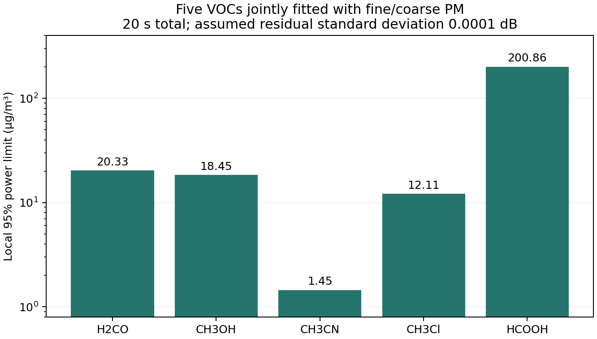

# Twenty seconds, nonzero calibration, more VOCs and PM size fractions

September 27, 2026. This extends the [receiver study](47_receiver_design_and_calibration.md). **All results assume a differential calibration residual standard deviation of 0.0001 dB unless stated otherwise. This has not been measured or demonstrated.** The reference and sample each occupy 10 seconds, including the existing receiver resource accounting. Standard atmosphere, 45 degrees elevation, matched reference weather, 23 dBm transmitting power and a 6 dB noise figure remain conditional requirements.

## Requested calibration comparison

With the original three VOCs plus fine/coarse PM fitted, acetonitrile at 1 µg/m³ has **90.20% simulated recall**, exact 95% interval **89.60–90.78%**, from 10,000 positives. Family false alarms are 0.85%. The predicted local 95% power limit is 1.087 µg/m³. The independently simulated simultaneous three-VOC/PM mixture gives 90.08%, consistent with this single-VOC control. At 0.001 dB, the original single-VOC control gives only 2.72%. These are distinct simulations, not field recall.

## Additional VOCs and interference

Six additional organic gas candidates were requested from [HITRAN](https://www.hitran.org/docs/molec-meta/): CH3Cl, HCOOH, CH3Br, C2H4, CH3F and CH3I. This is a spectroscopy inventory, not a claim that every candidate belongs to every regulatory VOC definition. CH3Cl and HCOOH yielded usable line lists, each with two available isotopologues. The retained 0–3000 GHz window contains 12,824 CH3Cl lines and 18,440 HCOOH lines; 670 and 401 respectively lie in 220–330 GHz. All four other candidates returned retrieval errors and remain **unavailable**, not zero absorption or absent molecules. The [acquisition ledger](../results/receiver_design/voc_pm_extension/acquisition.json) retains every attempt and exact input hashes. No missing spectrum was replaced with an invented one.

Exact pressure/temperature dependent Voigt spectra were integrated over the same refracted standard-atmosphere path at the 256 frozen receiver frequencies. Isotopic natural abundance is already included in HITRAN intensities and is not applied twice. Missing minor-isotope coverage remains a model limitation. Natural molar mass converts total mass concentration, while each isotope's HAPI mass is used for Doppler broadening. No frequency was chosen using these test outcomes.

All five VOCs and two PM masses are now fitted together. CO, O3, SO2, NO2, atmospheric background amplitude, common gain offset and slope remain nuisance parameters. PM10 is the sum of the two inferred masses including covariance. The family threshold is tightened from six to eight reported quantities, retaining the 1% budget.

| VOC | Local 95% power limit (µg/m³) | Simulated recall at 1 µg/m³ in the joint mixture |
|---|---:|---:|
| H2CO | 20.326 | 0.09% |
| CH3OH | 18.445 | 0.27% |
| CH3CN | 1.454 | 56.63% |
| CH3Cl | 12.113 | 0.41% |
| HCOOH | 200.863 | 0.17% |

The expanded mixture has 0.68% family false alarms in 10,000 null responses. The acetonitrile decline to **56.63%** reflects the expanded inverse problem and stricter family threshold. The earlier 90.20% result must not be generalized to five unknown VOCs. Adding target names does not add independent spectral information.

At the separately solved response limits, CH3Cl gives 95.11% recall at 12.114 µg/m³; HCOOH gives 95.16% at 200.879 µg/m³. Each has 10,000 nonlinear moment response draws, with positive-signal thermal variance and a persistent calibration residual drawn once per acquisition. These controlled limits are not useful detection at 1 µg/m³.

The [HITRAN2024 paper, page 31](https://hitran.org/media/refs/HITRAN-2024.pdf) explains that absolute pure rotational formic-acid intensities have not been measured and that its line strengths are computed from experimentally determined dipole moments. Catalog inclusion therefore does not provide independent measured validation of our forward model. Spectroscopic/model uncertainty is not included in the receiver noise intervals.

## PM masses and additional size fractions

PM2.5 and PM10 are overlapping mass cuts, not distinct chemicals. The original fit uses disjoint fine and coarse fractions; PM10 is their sum. The new simultaneous mixture retains the previously selected public Beijing values, fine 49 and coarse 41 µg/m³, giving PM10 = 90 µg/m³. This provides real concentration labels for a modeled radio response, not paired measured radio observations.

| PM output | Mixture concentration (µg/m³) | Simulated recall | Formal local 95% power scale (µg/m³) |
|---|---:|---:|---:|
| PM2.5 | 49 | 0.08% | 3.906e+12 |
| PMcoarse | 41 | 0.05% | 1.354e+11 |
| PM10 | 90 | 0.08% | 3.771e+12 |

These very low recalls are at the false-alarm scale. The enormous formal limits are diagnostics of insufficient information, not physically valid high-concentration predictions. Even an optimistic single-PM calculation with every gas, other PM mode and gain known gives limits of approximately 905 µg/m³ for fine PM and 1,111 µg/m³ for coarse PM at 20 s and 0.0001 dB. Allowing gain/background nuisance terms alone raises those scales to 1.35 × 10¹⁰ and 4.73 × 10⁸ µg/m³. Thus the failure is not solely competition with the new gases.

The finer size study uses disjoint aerodynamic cuts 0.03–1, 1–2.5 and 2.5–10 µm. It subdivides the existing fine lognormal distribution, applies the Stokes/Cunningham diameter conversion and recomputes full Mie extinction per unit mass. The first two cuts retain the same assumed composition as the prior fine mode; no new soot, salt or dust material constants are fabricated. PM1, PM2.5 and PM10 would be corresponding cumulative sums.

**The three-bin inverse calculation is rejected as numerically unstable.** At 20 s and 0.0001 dB the scaled target condition number is approximately 9.76 × 10⁷ and the scaled identity error is 0.508, far above the 10⁻⁵ acceptance gate. The failure also occurs at 20 s/0.001 dB and 100 s/0.0001 dB. Its arrays and errors are retained, but no unreliable size uncertainties are promoted to valid results. Positive mass clipping or renaming the three variables would not repair missing size information.

Material composition remains uncalibrated. The previously analyzed [measured calcite aerosol dataset](https://doi.org/10.57745/DLJEFW) contains useful transmission data, but the inspected records lack the paired mass and particle-size labels needed to calibrate these mass extinction coefficients. Optical/infrared constants cannot simply be substituted for 220–330 GHz properties. This extension therefore adds a size-identifiability test, not validated chemical discrimination among aerosol materials.

## What remains and next steps

The computation closes the requested 20 s calibration comparison, evaluates two additional VOCs jointly and explicitly tests an additional PM size split. It retains four spectroscopy acquisition gaps and the PM failures. It does not establish achievable calibration, absolute atmospheric concentration, field performance or useful PM sensing.

The next design step is to select frequencies against all five gases and gain nuisance terms using separate design conditions, then evaluate them on fresh weather and response draws while charging the same time, power and tuning resources. Missing gas candidates require line positions, intensities and atmospheric broadening from a supported source. PM composition requires measured sub-THz optical properties plus independently measured mass/size distributions. Calibration still requires independent sweeps under the intended receiver conditions.

Reproduce with `python scripts/acquire_receiver_vocs.py`, `python scripts/extend_receiver_voc_pm.py`, `python scripts/verify_receiver_voc_pm.py`, and `python scripts/report_receiver_voc_pm.py`. The acquisition is pinned by hashes rather than a promise that future online responses are identical. Original snapshots remain separate. This report uses 76 replay checks and retains the [sensitivity table](../results/receiver_design/voc_pm_extension/sensitivity.csv), [Monte Carlo counts and intervals](../results/receiver_design/voc_pm_extension/response_controls.csv) and [rejected size diagnostics](../results/receiver_design/voc_pm_extension/diagnostics.json).
