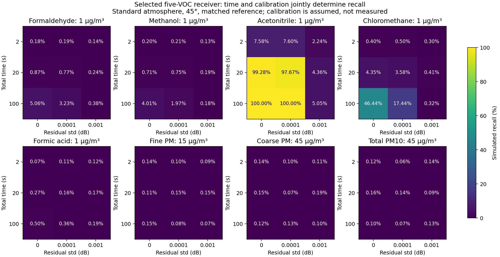
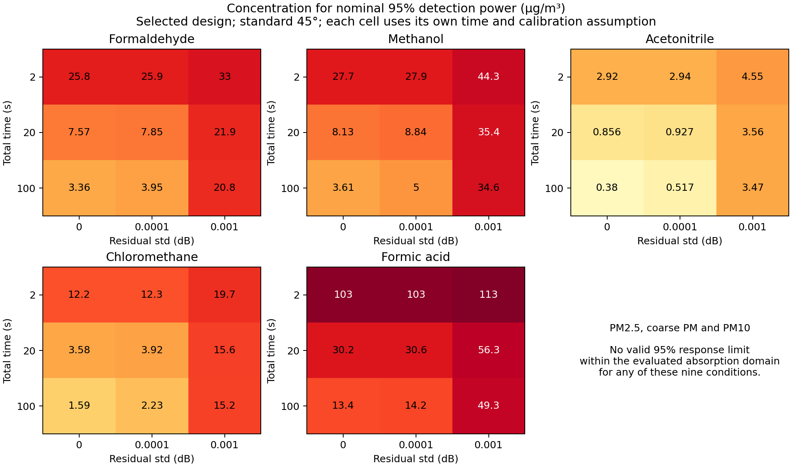
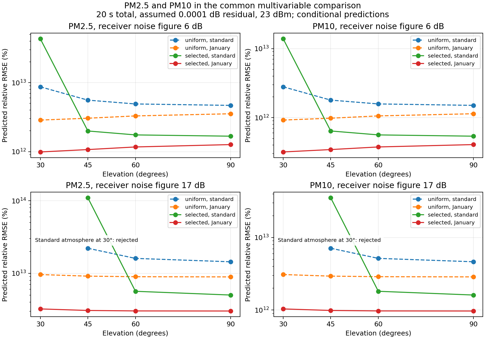

# Joint receiver design: low recall and 95% limits across time and calibration

The new design improves all five VOC information limits under the exact standard-atmosphere calculation. **At 20 s total and an assumed 0.0001 dB differential residual, acetonitrile at 1 µg/m³ has 97.67% simulated recall**, exact 95% interval 97.36–97.96%. The fresh uniform-design comparison is 57.40%. Both jointly fit five VOCs and two PM masses with the same resources and eight-output false-alarm family. **Calibration accuracy and hardware performance remain unmeasured.**

## What changed and why

The previous uniform hopping plan was not selected against the five-gas inverse problem. A deterministic coordinate-exchange screen now selects sixteen nonoverlapping blocks within 220–330 GHz using only the standard 45-degree design case. Its criterion improves the worst relative uncertainty among five gases while keeping PM and gain/background/interferent nuisance effects in the fit. Three deterministic starts are retained; no global optimum is claimed.

The coarse center approximation only selects a candidate. Exact Voigt spectra, Mie extinction, refracted paths and atmospheric emission were recomputed at every selected tone before evaluating it. January weather and fresh random responses did not select frequencies. Uniform and selected schedules have one RF chain, sixteen 16 MHz blocks, 1 MHz tone spacing, 23 dBm transmitting power, 6 dB receiver noise figure, identical CP/pilot overhead, both reference/sample acquisitions and 1 ms settling per hop. Frame rounding is charged at every duration.

The primary comparison below uses standard atmosphere at 45 degrees and matched reference weather. Every duration is **reference plus sample**, split equally. Residuals are zero mean correlated dB errors with a 10 GHz correlation length, drawn once per acquisition. The residual does not average away with payload symbols. Zero is an ideal extra-residual benchmark, not zero thermal noise.

## Low concentration and nominal 95% response side by side

This table uses **20 s total, 0.0001 dB assumed residual** throughout. It must not be read as a time-independent or calibration-independent detection limit. Each positive class and null class contains 10,000 trials.

| Target | Recall at 1 µg/m³ | Missed at 1 µg/m³ | Nominal 95% response concentration (µg/m³) | Actual simulated recall there | Exact 95% recall interval there |
|---|---:|---:|---:|---:|---:|
| Formaldehyde | 0.77% | 99.23% | 7.846 | 95.12% | 94.68–95.53% |
| Methanol | 0.75% | 99.25% | 8.838 | 95.12% | 94.68–95.53% |
| Acetonitrile | 97.67% | 2.33% | 0.927 | 95.12% | 94.68–95.53% |
| Chloromethane | 3.58% | 96.42% | 3.918 | 94.72% | 94.26–95.15% |
| Formic acid | 0.16% | 99.84% | 30.550 | 94.85% | 94.40–95.28% |

The primary family false-alarm frequency is 0.79%, under the fixed 1% budget. The 95% target is solved with positive-signal noise variance before simulation. Actual fractions near 95% remain unrounded to that target. A 95% detection rate is also not a 5% concentration error: relative RMSE at these limits is about 21% in this model.

## Complete time and calibration comparison

**Simulated recall at 1 µg/m³.** All five VOCs remain unknown parameters in every fit. Other target abundances are zero in these single-target positive controls; separate simultaneous mixture controls are retained in the CSV.

| Total reference + sample (s) | Residual std (dB) | H2CO | CH3OH | CH3CN | CH3Cl | HCOOH |
|---:|---:|---:|---:|---:|---:|---:|
| 2 | 0 | 0.18% | 0.20% | 7.58% | 0.40% | 0.07% |
| 2 | 0.0001 | 0.19% | 0.21% | 7.60% | 0.50% | 0.11% |
| 2 | 0.001 | 0.14% | 0.13% | 2.24% | 0.30% | 0.12% |
| 20 | 0 | 0.87% | 0.71% | 99.28% | 4.35% | 0.27% |
| 20 | 0.0001 | 0.77% | 0.75% | 97.67% | 3.58% | 0.16% |
| 20 | 0.001 | 0.24% | 0.19% | 4.36% | 0.41% | 0.17% |
| 100 | 0 | 5.06% | 4.01% | 100.00% | 46.44% | 0.50% |
| 100 | 0.0001 | 3.23% | 1.97% | 100.00% | 17.44% | 0.36% |
| 100 | 0.001 | 0.38% | 0.18% | 5.05% | 0.32% | 0.19% |

**Concentration required for nominal 95% response power, in µg/m³.** Each cell uses the time and calibration in its row. Finite simulation power checks, intervals and ppm conversions are retained separately.

| Total reference + sample (s) | Residual std (dB) | H2CO | CH3OH | CH3CN | CH3Cl | HCOOH |
|---:|---:|---:|---:|---:|---:|---:|
| 2 | 0 | 25.778 | 27.695 | 2.917 | 12.206 | 102.781 |
| 2 | 0.0001 | 25.862 | 27.911 | 2.938 | 12.309 | 102.894 |
| 2 | 0.001 | 33.018 | 44.262 | 4.550 | 19.693 | 113.332 |
| 20 | 0 | 7.568 | 8.131 | 0.856 | 3.584 | 30.171 |
| 20 | 0.0001 | 7.846 | 8.838 | 0.927 | 3.918 | 30.550 |
| 20 | 0.001 | 21.913 | 35.377 | 3.557 | 15.567 | 56.267 |
| 100 | 0 | 3.361 | 3.612 | 0.380 | 1.592 | 13.400 |
| 100 | 0.0001 | 3.945 | 4.999 | 0.517 | 2.226 | 14.228 |
| 100 | 0.001 | 20.826 | 34.603 | 3.468 | 15.192 | 49.310 |

For example, the local acetonitrile requirement for 95% power at 1 µg/m³ and 20 s is residual standard deviation no larger than approximately 0.000146 dB under this covariance model. The [acceptance table](../results/joint_receiver_revision/calibration_requirements.csv) repeats this inversion for all targets and times and adds a separate bound on persistent signed bias in the presence of the assumed 0.0001 dB random residual. These are requirements, not demonstrated stability.

## PM must use the same time/calibration comparison

Here fine PM is tested at 15 µg/m³, coarse PM at 45 µg/m³ and PM10 at 45 µg/m³. PM10 is injected with the declared 49:41 fine/coarse mixture ratio and estimated with its full covariance contrast. These are comparison concentrations, not a compliance assessment. Additional 49 and 90 µg/m³ controls and the original public 49/41 mixture are retained in the full table.

| Total s | Residual std dB | Fine PM recall at 15 µg/m³ | Coarse PM recall at 45 µg/m³ | PM10 recall at 45 µg/m³ | Valid 95% response concentration |
|---:|---:|---:|---:|---:|---|
| 2 | 0 | 0.14% | 0.14% | 0.12% | None within the evaluated domain |
| 2 | 0.0001 | 0.10% | 0.10% | 0.06% | None within the evaluated domain |
| 2 | 0.001 | 0.09% | 0.11% | 0.14% | None within the evaluated domain |
| 20 | 0 | 0.11% | 0.15% | 0.16% | None within the evaluated domain |
| 20 | 0.0001 | 0.15% | 0.07% | 0.14% | None within the evaluated domain |
| 20 | 0.001 | 0.15% | 0.19% | 0.09% | None within the evaluated domain |
| 100 | 0 | 0.15% | 0.12% | 0.10% | None within the evaluated domain |
| 100 | 0.0001 | 0.08% | 0.13% | 0.07% | None within the evaluated domain |
| 100 | 0.001 | 0.07% | 0.10% | 0.13% | None within the evaluated domain |

PM recall remains at approximately the false-alarm scale. No finite 95% response solution lies within the ≤1 dB added-absorption domain for these nine conditions. Very large local information scales remain in the sensitivity CSV only as diagnostics; they are not valid high-concentration sensing claims. The failed PM1/fine/coarse separation and unmeasured composition are explained in the [species and methods guide](50_species_methods_and_percentage_guide.md).

## Global comparison: all VOCs, PM2.5 and PM10 under the same variables

The [common global CSV](../results/joint_receiver_revision/global_comparison.csv) contains **2,304 rows across 288 operating conditions**, with all eight outputs present in every condition. It crosses two band plans, two atmospheres (standard and January), four elevations (30, 45, 60, 90 degrees), three total times (2, 20, 100 s), three assumed residuals (0, 0.0001, 0.001 dB), and two receiver noise figures (6, 17 dB). Power is fixed at 23 dBm; residual correlation length is 10 GHz and reference weather is matched. These are conditional predictions using positive-response noise variance; the separate Monte Carlo table supplies simulated frequencies and binomial intervals. There are no field measurements in either table.

Each output has 270 computed conditions and 18 rejected conditions. A rejected condition is unavailable, not a zero recall or a successful limit. Ranges below are envelopes over different conditions, not uncertainty intervals or a typical deployment. Gas and PM reference concentrations differ and therefore their percentages must not be interpreted as a same-concentration species ranking.

| Output | Reference µg/m³ | Computed conditions | Rejected conditions | Predicted recall range | Predicted relative RMSE range | Conditions with valid 95% response limit |
|---|---:|---:|---:|---:|---:|---:|
| H2CO | 1 | 270 | 18 | 0.128–89.043% | 23.5–1.42e+04% | 270 |
| CH3OH | 1 | 270 | 18 | 0.130–72.886% | 27.5–9.02e+03% | 270 |
| CH3CN | 1 | 270 | 18 | 0.282–100.000% | 3.33–391% | 270 |
| CH3Cl | 1 | 270 | 18 | 0.139–100.000% | 12.3–3.2e+03% | 270 |
| HCOOH | 1 | 270 | 18 | 0.125–12.651% | 53.2–2.94e+05% | 269 |
| PM2.5 | 15 | 270 | 18 | 0.125–0.125% | 3.22e+11–3.91e+14% | 0 |
| PMcoarse | 45 | 270 | 18 | 0.125–0.125% | 3.76e+09–4.68e+12% | 0 |
| PM10 | 45 | 270 | 18 | 0.125–0.125% | 1.04e+11–1.26e+14% | 0 |

PM10 is always the fine plus coarse mass contrast with cross covariance; its positive control has fine mass fraction 49/90. PM2.5 and PM10 have no valid 95% response limit anywhere in this tested grid. The complete CSV provides the exact conditions, misses, concentration error, limit validity, SNR and resource fields for each row. The figure below shows a declared 20 s/0.0001 dB slice; the CSV also contains the other time/calibration combinations.

## Independent-condition checks and remaining failures

At 20 s/0.0001 dB and matched January weather, selected-design acetonitrile recall at 1 µg/m³ is 100.00% (exact interval 99.96–100.00%). This is a conditional weather control, not a population or field guarantee. The four tested elevations are 30, 45, 60 and 90 degrees; the full sensitivity table recomputes both schedules across them. The separate January-background mismatch applied to a frozen standard operator still produces bias; matched-weather success does not solve unknown weather.

Changing residual frequency correlation changes the limits even at the same standard deviation. Independent unknown hop gains fail numerical target separation, the 17 dB noise-figure stress degrades gas performance, and the unamplified converter fails the SNR gate. These outcomes are in [stress sensitivity](../results/joint_receiver_revision/stress_sensitivity.csv).

Sixteen fresh moving raw coded-frame spot checks cover every selected center; passive sensing preserves decoded output under the bounded existing synchronization model. The selected schedule nevertheless loses **14.64%** of the Gaussian-input information-rate benchmark relative to the best fixed block among the tested schedules at equal instantaneous bandwidth and power. This includes frequency choice and scheduling, whereas the earlier 1.382% figure isolated scheduling counts. Neither is QPSK coded throughput or a measured hardware rate. A globally optimized communication baseline could be stronger. The original zero-capacity-degradation ambition is therefore not established for the architecture.

## Detailed per-VOC percentage tables

All tables below use the selected design, standard atmosphere, 45 degrees and matched reference. Every row has its own time and calibration assumption. The [full CSV](../results/joint_receiver_revision/response_metrics.csv) additionally provides miss rate, per-target false alarms, specificity, exact binomial intervals, precision/F1 at 50% test prevalence, balanced accuracy, signed bias, absolute/relative RMSE, negative estimates and surface-equivalent gas ppm.

### Formaldehyde (H2CO)

| Total s | Residual dB | Recall at 1 µg/m³ | Recall at 5 µg/m³ | Recall at 10 µg/m³ | 95% response concentration µg/m³ | Actual recall there | Relative RMSE there |
|---|---|---:|---:|---:|---:|---:|---:|
| 2 | 0 | 0.18% | 1.81% | 11.23% | 25.778 | 95.02% | 21.11% |
| 2 | 0.0001 | 0.19% | 1.59% | 10.29% | 25.862 | 95.11% | 21.24% |
| 2 | 0.001 | 0.14% | 0.96% | 5.35% | 33.018 | 95.03% | 21.31% |
| 20 | 0 | 0.87% | 52.55% | 99.91% | 7.568 | 95.25% | 21.45% |
| 20 | 0.0001 | 0.77% | 48.12% | 99.88% | 7.846 | 95.12% | 21.14% |
| 20 | 0.001 | 0.24% | 2.43% | 18.61% | 21.913 | 94.75% | 21.40% |
| 100 | 0 | 5.06% | 99.99% | 100.00% | 3.361 | 94.79% | 21.26% |
| 100 | 0.0001 | 3.23% | 99.77% | 100.00% | 3.945 | 95.00% | 21.29% |
| 100 | 0.001 | 0.38% | 3.21% | 21.70% | 20.826 | 94.67% | 21.51% |

### Methanol (CH3OH)

| Total s | Residual dB | Recall at 1 µg/m³ | Recall at 5 µg/m³ | Recall at 10 µg/m³ | 95% response concentration µg/m³ | Actual recall there | Relative RMSE there |
|---|---|---:|---:|---:|---:|---:|---:|
| 2 | 0 | 0.20% | 1.34% | 9.05% | 27.695 | 94.84% | 21.59% |
| 2 | 0.0001 | 0.21% | 1.61% | 8.96% | 27.911 | 94.59% | 21.38% |
| 2 | 0.001 | 0.13% | 0.79% | 2.25% | 44.262 | 94.89% | 21.47% |
| 20 | 0 | 0.71% | 44.58% | 99.73% | 8.131 | 95.14% | 21.23% |
| 20 | 0.0001 | 0.75% | 33.92% | 98.63% | 8.838 | 95.12% | 21.24% |
| 20 | 0.001 | 0.19% | 1.01% | 4.49% | 35.377 | 94.99% | 21.37% |
| 100 | 0 | 4.01% | 99.97% | 100.00% | 3.612 | 95.29% | 21.17% |
| 100 | 0.0001 | 1.97% | 95.29% | 100.00% | 4.999 | 94.71% | 21.69% |
| 100 | 0.001 | 0.18% | 0.73% | 4.41% | 34.603 | 94.97% | 21.45% |

### Acetonitrile (CH3CN)

| Total s | Residual dB | Recall at 1 µg/m³ | Recall at 5 µg/m³ | Recall at 10 µg/m³ | 95% response concentration µg/m³ | Actual recall there | Relative RMSE there |
|---|---|---:|---:|---:|---:|---:|---:|
| 2 | 0 | 7.58% | 100.00% | 100.00% | 2.917 | 94.92% | 21.55% |
| 2 | 0.0001 | 7.60% | 100.00% | 100.00% | 2.938 | 95.14% | 21.52% |
| 2 | 0.001 | 2.24% | 98.33% | 100.00% | 4.550 | 95.04% | 21.44% |
| 20 | 0 | 99.28% | 100.00% | 100.00% | 0.856 | 95.00% | 21.65% |
| 20 | 0.0001 | 97.67% | 100.00% | 100.00% | 0.927 | 95.12% | 21.49% |
| 20 | 0.001 | 4.36% | 100.00% | 100.00% | 3.557 | 95.42% | 21.34% |
| 100 | 0 | 100.00% | 100.00% | 100.00% | 0.380 | 94.62% | 21.46% |
| 100 | 0.0001 | 100.00% | 100.00% | 100.00% | 0.517 | 94.42% | 21.57% |
| 100 | 0.001 | 5.05% | 99.99% | 100.00% | 3.468 | 95.16% | 21.31% |

### Chloromethane (CH3Cl)

| Total s | Residual dB | Recall at 1 µg/m³ | Recall at 5 µg/m³ | Recall at 10 µg/m³ | 95% response concentration µg/m³ | Actual recall there | Relative RMSE there |
|---|---|---:|---:|---:|---:|---:|---:|
| 2 | 0 | 0.40% | 14.26% | 78.76% | 12.206 | 95.07% | 21.33% |
| 2 | 0.0001 | 0.50% | 13.06% | 78.08% | 12.309 | 95.29% | 21.18% |
| 2 | 0.001 | 0.30% | 3.12% | 25.15% | 19.693 | 94.91% | 21.43% |
| 20 | 0 | 4.35% | 99.96% | 100.00% | 3.584 | 94.85% | 21.64% |
| 20 | 0.0001 | 3.58% | 99.79% | 100.00% | 3.918 | 94.72% | 21.64% |
| 20 | 0.001 | 0.41% | 6.26% | 49.09% | 15.567 | 94.93% | 21.30% |
| 100 | 0 | 46.44% | 100.00% | 100.00% | 1.592 | 94.97% | 21.43% |
| 100 | 0.0001 | 17.44% | 100.00% | 100.00% | 2.226 | 94.95% | 21.36% |
| 100 | 0.001 | 0.32% | 6.81% | 51.01% | 15.192 | 95.33% | 21.27% |

### Formic acid (HCOOH)

| Total s | Residual dB | Recall at 1 µg/m³ | Recall at 5 µg/m³ | Recall at 10 µg/m³ | 95% response concentration µg/m³ | Actual recall there | Relative RMSE there |
|---|---|---:|---:|---:|---:|---:|---:|
| 2 | 0 | 0.07% | 0.25% | 0.57% | 102.781 | 95.33% | 21.34% |
| 2 | 0.0001 | 0.11% | 0.23% | 0.47% | 102.894 | 94.55% | 21.51% |
| 2 | 0.001 | 0.12% | 0.28% | 0.47% | 113.332 | 94.48% | 21.49% |
| 20 | 0 | 0.27% | 1.06% | 7.19% | 30.171 | 94.86% | 21.41% |
| 20 | 0.0001 | 0.16% | 1.21% | 6.82% | 30.550 | 94.85% | 21.55% |
| 20 | 0.001 | 0.17% | 0.35% | 1.33% | 56.267 | 95.47% | 21.12% |
| 100 | 0 | 0.50% | 10.47% | 67.98% | 13.400 | 95.02% | 21.45% |
| 100 | 0.0001 | 0.36% | 8.08% | 60.21% | 14.228 | 94.73% | 21.43% |
| 100 | 0.001 | 0.19% | 0.43% | 2.06% | 49.310 | 94.85% | 21.54% |

## Verification, interpretation and reproduction

The retained [verification](../results/joint_receiver_revision/verification.json) replays 25,172 checks over 480 percentage/error rows, 1152 sensitivity rows and 2304 common global rows. There are twelve response cases, including all nine primary time/calibration combinations. These checks verify numerical/reporting consistency, not physical truth. Results preserve low recalls, failed PM limits, source hashes and resource costs.

Run `python scripts/select_joint_receiver.py`, `python scripts/compute_joint_receiver_physics.py`, `python scripts/evaluate_joint_receiver.py`, `python scripts/stress_joint_receiver.py`, `python scripts/global_joint_receiver_comparison.py`, `python scripts/verify_joint_receiver.py`, and `python scripts/report_joint_receiver.py`. Use one BLAS thread per physics worker. The selection must remain frozen before evaluating the held-out conditions and response draws. Existing snapshots remain historical; the new deliverable manifest records this revision.

The [complete audit](49_completion_audit_and_fixes.md) lists every identified remaining issue and its completion criterion. The main unresolved items are achievable RF/calibration performance, useful PM information, full receiver dynamics/reference conditions, unknown weather/profiles/baseline, independent paired measurements and environmental applicability.
