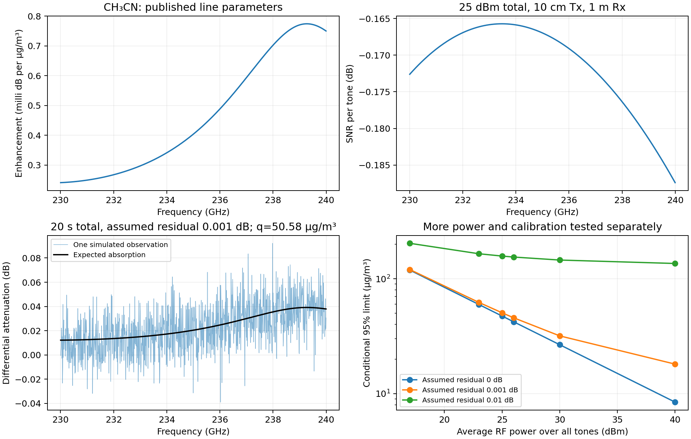

# Detecting one compound at 90°: intuition, measurements and matrices

5 October 2026. This is a reproducible teaching example requested by the supervisor. **LEO links provide one useful example throughout the complete sensing chain**, from geometry and hardware to spectroscopy and inference. The same reasoning can be adapted to terrestrial and UAV paths.

The compound is **acetonitrile, CH₃CN**. The question is: *has its concentration increased relative to a reference transmission?* The example estimates one concentration amplitude with an assumed vertical shape. It does not recover an arbitrary concentration at each height.

The result depends on **20 s total acquisition, ideal tracking, matched atmospheric background, the specified apertures and power, and an assumed 0.001 dB differential calibration residual that has not been measured**. Under those conditions the nominal 95% detection concentration is **50.58 µg/m³**. Simulated complex pilot observations give **94.75%** response there and **1.31%** at 1 µg/m³. These are not measured field recall values. The [supervisor response](54_supervisor_revision_2026_10_05.md) explains the hardware evidence and practical limitations.

## First, the intuition

1. Put the satellite directly above the ground receiver. The signal crosses the atmosphere once along the shortest path.
2. Transmit many known OFDM pilot tones covering 230–240 GHz. Every tone receives a share of the same total transmitter power.
3. The receiver measures the amplitude at every frequency. Geometry, antennas, oxygen, water and the electronics already affect these amplitudes.
4. Repeat the measurement for a reference and for the sample. Correct known motion and instrument response, then compare their amplitudes. An increase in acetonitrile produces a characteristic frequency dependent attenuation.
5. Compare that measured pattern with a pattern calculated from real spectroscopic line parameters. Allow an unknown common gain change and gain slope so that they are not automatically mistaken for gas.
6. Average enough pilots to reduce thermal uncertainty. Carry the reference uncertainty and persistent calibration error through the calculation.
7. Estimate the concentration and compare it with a threshold fixed before inspecting the sample. Report both successful and failed detections.

A dip in one noisy tone is not enough. The detector uses the part of the whole molecular pattern that cannot be explained by the allowed gain changes. A different gas or an unmodeled weather change can still imitate that pattern; the simple example assumes other species do not change.

## 1. Fix the inputs and their meaning

| Input | Value | Evidence or status |
| --- | --- | --- |
| Species | CH₃CN, 17,880 retained transitions, local isotope ID 1 | Acquired HITRAN catalog, recorded in the [physics provenance](../results/zenith_single_compound/physics_provenance.json); [HITRAN molecule 41](https://hitran.org/lbl/) |
| Atmospheric state | Sea level standard atmosphere to 100 km | [ITU P.835](https://www.itu.int/rec/R-REC-P.835-7-202408-I/en) |
| Oxygen and water attenuation/emission | Frequency dependent | [ITU P.676](https://www.itu.int/rec/R-REC-P.676-13-202208-I), implemented in the repository |
| Satellite height and elevation | 550 km, 90° ground elevation | Chosen LEO example, not an observed orbit |
| Concentration shape | $c(z)=q\exp(-z/1500\ {\rm m})$ | Assumed shape; $q$ is the surface equivalent enhancement in µg/m³ |
| Instantaneous occupied band | 230–240 GHz | Chosen teaching band containing an acetonitrile feature; not optimized or hardware qualified |
| Total average RF output | 25 dBm, 316 mW | Published LEO design anchor; actual linear OFDM output remains a requirement |
| Transmit/receive apertures | 0.10 m / 1.0 m, efficiency 0.65 | Circular aperture model; ground size also has a published design precedent; exact efficiencies assumed |
| Receiver | Noise figure 7 dB, reference temperature 290 K | Published design anchor; sky emission calculated separately |
| Additional power loss | 5 dB | Assumed combined implementation budget |
| Calibration residual | 0.001 dB standard deviation, exponential 10 GHz frequency correlation | Assumed differential covariance, not measured stability |
| False alarm probability | 1% for this one prespecified compound | Fixed statistical design choice |

The hardware anchors and their original scope are documented in the [source comparison](54_supervisor_revision_2026_10_05.md#hardware-references-and-selected-assumptions). No source demonstrates this entire configuration, bandwidth, calibration and orbital measurement together.

The standard atmosphere supplies pressure, temperature and humidity. It supplies no acetonitrile concentration truth. HITRAN supplies spectroscopic parameters, not measured satellite CSI. The concentrations used below are controlled simulation inputs.

## 2. Calculate the molecular template

For frequency $f_k$ and altitude $z$, calculate a Voigt cross section $\sigma_k(T(z),p(z))$ from line positions, strengths, air broadening, temperature scaling and HAPI partition functions. Natural isotopic abundance is already in the HITRAN line intensity and is not applied twice. The retained CH₃CN catalog covers line centres from 2.775 to 2003.459 GHz; its full acquired line wings are included. These modeling choices and catalog limits remain sources of physical uncertainty.

One µg/m³ of CH₃CN corresponds at the surface to

$$
n_0=\frac{10^{-6}\ {\rm g/m^3}}{41.053\ {\rm g/mol}}N_A
 \simeq 1.467\times10^{16}\ {\rm molecules/m^3}.
$$

The attenuation template per unit $q$ is

$$
a_k=\frac{10}{\ln 10}\int_0^{100\,{\rm km}}
\sigma_k(T(z),p(z))\,n_0\,e^{-z/1500\,{\rm m}}\,dz.
$$

In this equation use SI cross sections and number densities. The implementation uses cm² and cm⁻³ and therefore converts each metre of path to 100 cm. The result is in **dB per µg/m³**. There is no two way radar factor: the receiver measures a direct downlink.

The predicted gas enhancement is $a_kq$. At the first tone, 230.0048828125 GHz, $a_k=0.00024081996$ dB per µg/m³. The full [tone table](../results/zenith_single_compound/tone_by_tone.csv) contains all 1024 values. Gas quadrature orders six and ten agree to a maximum relative difference of $1.76\times10^{-9}$ at 65 check frequencies. That checks integration, not the experimental accuracy of the line parameters or assumed profile.

The corresponding vertical mass column is approximately $1500q$ µg/m². If the true profile differs, the retrieved $q$ is a model dependent surface equivalent; it is not an independently measured surface concentration.

## 3. Calculate the link and the noise before simulating observations

At zenith the slant range is exactly 550 km. For each tone,

$$
G_{t,k}=\eta_t(\pi D_t f_k/c)^2,\qquad
G_{r,k}=\eta_r(\pi D_r f_k/c)^2,
$$

$$
P_{r,k}=\frac{P_t}{K}\,G_{t,k}G_{r,k}
\left(\frac{c}{4\pi d f_k}\right)^2
10^{-[A_{{\rm bg},k}+a_kq+L_{\rm impl}]/10}.
$$

Here $K=1024$, $P_t$ is total average RF power, $A_{\rm bg}$ is the integrated oxygen/water loss and $L_{\rm impl}=5$ dB. Gain is a power ratio. In the reference, the enhancement $q=0$.

The receiver equivalent noise temperature is

$$
T_e=290(10^{7/10}-1),\qquad
N_k=k_B(T_{{\rm sky},k}+T_e)\Delta f,\qquad
\rho_k=P_{r,k}/N_k.
$$

The atmospheric radiative transfer model supplies $T_{\rm sky}$. Do not multiply this result by the noise factor again. The reference hardware convention and unmodeled antenna/receiver losses are discussed in the supervisor note.

The first tone gives the following complete power accounting:

| Term | Value |
| --- | ---: |
| Power per tone | −5.1030 dBm |
| Satellite gain | 45.7705 dBi |
| Ground gain | 65.7705 dBi |
| Free space path loss | 194.4898 dB |
| Background gas loss | 4.5477 dB |
| Implementation loss | 5 dB |
| Received power | −97.5996 dBm |
| Receiver noise in one tone | −97.4270 dBm |
| SNR | −0.1726 dB |

The low instantaneous SNR does not prevent averaging known pilots in the ideal tracked model. It also does not prove that a chosen payload code, acquisition system or oscillator works at that SNR. No decoded communication rate is demonstrated by this example.

## 4. Define the actual OFDM resources and observation time

$$
B=10^{10}\ {\rm Hz},\quad
\Delta f=B/K=9.765625\ {\rm MHz},\quad
T_u=1/\Delta f=102.4\ {\rm ns},
$$

$$
T_{\rm CP}=10\ {\rm ns},\qquad T_s=T_u+T_{\rm CP}=112.4\ {\rm ns}.
$$

A frame has 10,000 symbols, of which 30 are full known pilot symbols. The pilot fraction is 0.3%. The remaining symbols are reserved for communication and are **not** counted as observations in this teaching detector. This is a selected frame structure, not a cited modem standard.

Allocate ten seconds to the reference and ten seconds to the sample. Each complete frame takes 1.124 ms, so

$$
F=\left\lfloor\frac{10}{10000T_s}\right\rfloor=8896,\qquad
M=30F=266880
$$

known pilots are available **per tone in each acquisition**. The complete transmitted duration is 19.998208 s, with 0.001792 s left by frame rounding. Both acquisitions and their CP/payload time are charged. Waiting between matched passes, obtaining concentration truth and calibrating the instrument are additional elapsed time.

At 90° the instantaneous Doppler is zero. Over a real ten second interval centred on zenith, both geometry and phase change. The mathematical calculation here is a stationary zenith benchmark assuming correction of phase, delay and geometric gain. The [motion table](../results/zenith_single_compound/motion.csv) explicitly shows how this approximation differs from a real pass. Two matched reference/sample windows are a measurement assumption; a satellite cannot hover at zenith or provide two different atmospheric states simultaneously.

## 5. Build the complex observation matrix

Let the known pilots be $X\in\mathbb C^{K\times M}$, with unit magnitude entries, and absorb per tone received power into the channel coefficient $h_k$:

$$
Y_r=\operatorname{diag}(h_r)X_r+W_r,\qquad
r\in\{0,1\}.
$$

$r=0$ denotes reference and $r=1$ sample. $Y_r$ is $1024\times266880$, the diagonal channel matrix is $1024\times1024$, and $W_{r,km}$ is circular complex Gaussian noise with variance $N_k$. This is the ideal FFT domain model after timing, carrier and phase correction. It assumes negligible residual intercarrier interference and a channel adequately flat within each tone.

The pilot estimate is

$$
\widehat h_{r,k}=\frac1M\sum_{m=1}^M
Y_{r,km}X_{r,km}^{*}.
$$

The implementation samples the distribution of this mean directly:

$$
\widehat h_{r,k}\sim\mathcal{CN}(h_{r,k},N_k/M).
$$

This is an exact sufficient statistic for the stated independent complex Gaussian, known phase model. It avoids storing hundreds of millions of pilots. It is **not** a raw time domain IFFT/CP synchronization simulation or a claim that ten seconds of uncorrected samples remain phase coherent. A practical receiver must estimate and correct phase in shorter intervals, with those errors included later.

After correcting known differences between reference and sample link gains, form a positive attenuation increase:

$$
y_k=-20\log_{10}
\frac{|\widehat h_{1,k}|}{|\widehat h_{0,k}|}.
$$

Do not use the same pilot based channel amplitude equalizer to normalize away the absorption before sensing. The equalized communication stream and the calibrated sensing amplitudes have different roles.

## 6. Construct the regression matrix and covariance

Use

$$
\mathbf y=\mathbf a q+B\boldsymbol\beta+\boldsymbol\epsilon
=A\boldsymbol\theta+\boldsymbol\epsilon,
$$

$$
u_k=\frac{f_k-\overline f}{f_{\max}-f_{\min}},\quad
B=[\mathbf1,\mathbf u],\quad
A=[\mathbf a,\mathbf1,\mathbf u],\quad
\boldsymbol\theta=(q,b_0,b_1)^T.
$$

The shapes are $A:1024\times3$, $B:1024\times2$, $\mathbf y:1024\times1$ and $\boldsymbol\theta:3\times1$. $b_0$ and $b_1$ are differential gain offset and slope in dB. The gas column has units dB per µg/m³; the other two columns are dimensionless.

The log magnitude delta method gives

$$
v_k(q)=\frac{(20/\ln10)^2}{2M}
\left(\frac1{\rho_{0,k}}+\frac1{\rho_{1,k}(q)}\right),
\qquad
\rho_{1,k}(q)=\rho_{0,k}10^{-a_kq/10}.
$$

At the null, equal reference/sample SNR gives
$v_k(0)=(20/\ln10)^2/(M\rho_{0,k})$.
The averaged reference SNR is above 255,000 on every tone, supporting the local log approximation; the later complex observation control checks it numerically.

Model the remaining **differential** calibration covariance as

$$
C(q)=\operatorname{diag}(v_k(q))+\sigma_{\rm cal}^2 R,\qquad
R_{ij}=\exp(-|f_i-f_j|/10\ {\rm GHz}),\quad
\sigma_{\rm cal}=0.001\ {\rm dB}.
$$

$C$ is $1024\times1024$ in dB². Calibration is sampled once for the complete reference/sample pair. Its variance is not divided by the pilot count and is not doubled again: it is already differential. This stochastic model is not a bound on arbitrary systematic drift. Weather mismatch and changing interferents are not automatically included in it.

## 7. Eliminate gain changes and estimate the concentration

Use the covariance at the null, $C_0=LL^T$. Whiten the data and templates:

$$
\widetilde{\mathbf y}=L^{-1}\mathbf y,\qquad
\widetilde{\mathbf a}=L^{-1}\mathbf a,\qquad
\widetilde B=L^{-1}B.
$$

Let $Q$ contain orthonormal columns spanning $\widetilde B$, and project out those directions:

$$
P_\perp=I-QQ^T,\quad
\mathbf r=P_\perp\widetilde{\mathbf a}.
$$

Then

$$
\widehat q=\frac{\mathbf r^T\widetilde{\mathbf y}}{\mathbf r^T\mathbf r}
=H\mathbf y,\qquad
H=\frac{\mathbf r^T L^{-1}}{\mathbf r^T\mathbf r},\qquad
s_0^2=H C_0 H^T.
$$

Do not form a large inverse in software. The implementation uses Cholesky triangular solves and SVD. It checks the target rank after nuisance removal. If the gas pattern is indistinguishable from a gain offset/slope, the estimator rejects it.

The saved baseline satisfies $H\mathbf a=1$ to $5.6\times10^{-16}$ and $HB=0$ to about $10^{-12}$. Its concentration standard deviation is **12.7313 µg/m³**. The signed estimate is retained, including negative values, so the null distribution and false alarms remain meaningful.

All numerical arrays are saved in [matrices.npz](../results/zenith_single_compound/matrices.npz); the [tone table](../results/zenith_single_compound/tone_by_tone.csv) also exposes every template and estimator weight.

## 8. A small matrix that can be inspected by hand

Take only tones 0, 255, 511, 767 and 1023 from the full example. Their design is

$$
A_5\simeq
\begin{bmatrix}
0.000240820&1&-0.500000\\
0.000280424&1&-0.250733\\
0.000403271&1&-0.000489\\
0.000648908&1& 0.249756\\
0.000750080&1& 0.500000
\end{bmatrix}.
$$

The covariance restricted to those measurements is

$$
C_5\simeq10^{-4}
\begin{bmatrix}
2.951529&0.007796&0.006071&0.004728&0.003682\\
0.007796&2.947224&0.007788&0.006065&0.004724\\
0.006071&0.007788&2.947702&0.007788&0.006065\\
0.004728&0.006065&0.007788&2.952581&0.007788\\
0.003682&0.004724&0.006065&0.007788&2.961572
\end{bmatrix}\ {\rm dB^2}.
$$

For the saved simulated observation,

$$
\mathbf y_5\simeq
\begin{bmatrix}
-0.000463815\\0.025099503\\-0.031417175\\0.018701897\\0.030551022
\end{bmatrix}\ {\rm dB},
$$

$$
H_5\simeq
\begin{bmatrix}
4942.686&-4201.176&-5681.920&4215.931&724.479
\end{bmatrix}.
$$

Multiplication gives $\widehat q_5=171.75$ µg/m³, but its standard deviation is **165.12 µg/m³**. It therefore fails the 1% test: the threshold is about 384.12 µg/m³. Five individual tones discard most of the information; this miniature is for inspecting the matrix operations, not the reported 1024 tone result. Rounded entries above are for reading; exact values are in [worked_example.json](../results/zenith_single_compound/worked_example.json).

## 9. Fix the decision rule, then inspect the result

Test a single positive enhancement:

$$
\mathcal H_0:q=0,\qquad \mathcal H_1:q>0,\qquad
Z=\widehat q/s_0.
$$

With 1% false alarm probability, the Gaussian threshold is

$$
Z>2.32635
\quad\Longleftrightarrow\quad
\widehat q>29.6174\ {\rm \mu g/m^3}.
$$

This is the concentration **decision threshold**, not the concentration at which 95% of true positives are detected. For a true enhancement $q$, retain the signal dependent sample variance:

$$
s_1(q)=\sqrt{H C(q)H^T},\qquad
P_D(q)=1-\Phi\left(\frac{29.6174-q}{s_1(q)}\right).
$$

Solving $P_D(q)=0.95$ gives **50.5814 µg/m³**. The fixed variance approximation is 50.5585 µg/m³. The difference is small here because absorption at that concentration is modest.

The true concentration for the illustrated observation was chosen at this analytical limit before drawing the random sample. The full 1024 tone estimate is **39.4247 µg/m³**, above 29.6174, so that particular simulated observation is detected. The estimate is not exactly the truth; one successful decision is not a detection rate.

The separate control uses 10,000 independent reference/sample pairs per condition, complex Gaussian pilot means and one correlated calibration residual per pair:

| True enhancement | Predicted response | Simulated response | 95% binomial interval |
| ---: | ---: | ---: | ---: |
| 0 µg/m³ | 1.00% false alarm | 1.13% | 0.93–1.36% |
| 1 µg/m³ | 1.23% | 1.31% | 1.10–1.55% |
| 50.5814 µg/m³ | 95.00% | 94.75% | 94.29–95.18% |

**Every row assumes the same unmeasured 0.001 dB calibration residual, 20 s total acquisition and ideal tracking.** The null result is consistent with the nominal false alarm probability; it is not exactly 1%. At 1 µg/m³ the detector has essentially no useful power. The raw concentration draws and [receiver control table](../results/zenith_single_compound/receiver_control.csv) retain the finite simulation outcomes.

## 10. What changes the answer in reality?

The complete [sensitivity table](../results/zenith_single_compound/sensitivity.csv) varies power, antennas, noise, time and calibration. Under otherwise identical conditions and a 0.001 dB assumed residual, raising power from 25 to 30 dBm changes the predicted 95% limit from 50.58 to 31.83 µg/m³. It does not establish an available 1 W linear transmitter.

Allowing an additional unknown background attenuation amplitude raises the local 95% scale to **83.63 µg/m³**. This model still does not cover arbitrary weather changes. The [weather mismatch controls](../results/zenith_single_compound/weather_mismatch.csv) separately show the apparent gas produced by controlled changes in water vapour and temperature on a blank path. Their perturbations are sensitivity tests, not measured weather error probabilities. Calibration requirements must be measured using the intended receiver and reference timing; see the [permanent calibration qualification](46_critical_calibration_assumption.md).

Other gases are held fixed in this first lesson. Detecting a known candidate is easier than identifying an unknown mixture. Add their templates as target or nuisance columns before claiming chemical specificity. PM extinction, beam pointing, phase noise, finite bandwidth response, RF backoff, cloud/rain attenuation and vertical profile uncertainty also need characterization. The zero residual and high power controls are useful bounds; they are not field demonstrations.

For environmental scale, the [EMeRGe analysis](https://acp.copernicus.org/articles/23/1893/2023/index.html) reports a 145 pptv winter background from selected aircraft measurements. At 288.15 K and 101325 Pa that mixing ratio would correspond to about 0.252 µg/m³. Our 50.58 µg/m³ surface equivalent enhancement is about 29.1 ppbv at the same state. These are different profiles and observables, but the comparison makes clear that this demonstration does not establish background atmospheric detection.

## What was done and how to reproduce it

This walkthrough makes the supervisor's requested simple case explicit before returning to the full joint model. The implementation adds a source based gas template, a 10 GHz resource plan, a complete link budget, reference/sample uncertainty, nuisance projected estimation and complex observation controls. It retains an unsuccessful low concentration case and avoids presenting simulated performance as experimental validation.

From the repository root, using its existing scientific dependencies:

    py -3.12 scripts/run_zenith_tutorial.py
    py -3.12 -m pytest tests/test_zenith_tutorial.py -q

The implementation is in [the tutorial module](../src/thz_isac/zenith_tutorial.py) and [the reproduction script](../scripts/run_zenith_tutorial.py). The [manifest](../results/zenith_single_compound/manifest.json) records code, package versions and result hashes. Existing HITRAN acquisition is a prerequisite; no invented line spectrum substitutes for a missing catalog.

What remains is hardware and atmospheric validation, a defensible reference protocol and the moving wideband receiver. Next, measure receiver stability and repeat this same small calculation with those measurements before extending the matrix to more chemicals or three dimensional imaging.
